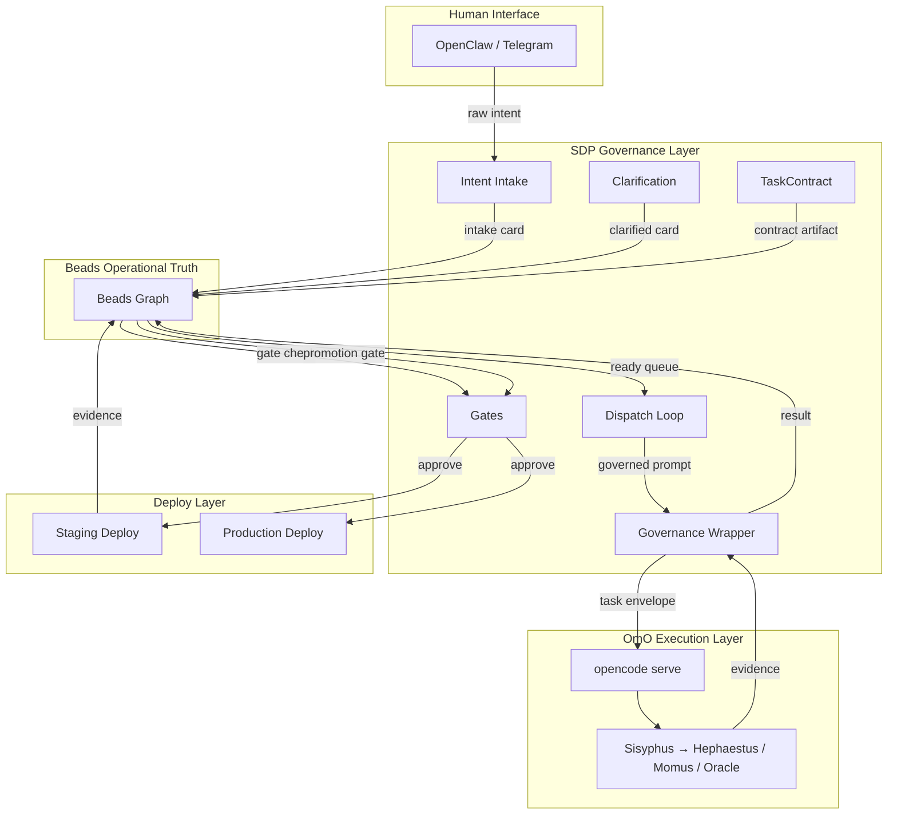
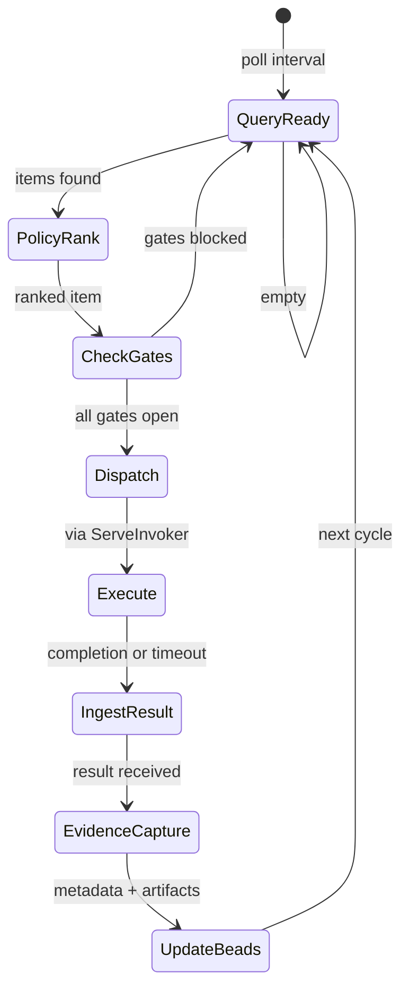

# Canonical SDP Pipeline

> **Status:** Active v1.1 (F106 complete — agentloop integration)
> **Date:** 2026-04-26
> **Owner:** Андрей + Клавдий
> **Scope:** Intent → Production Deploy, full lifecycle

---

## 1. Position

SDP is the governance layer. OmO is the execution layer. Beads is the operational truth. OpenClaw is the human interface.

**The pipeline is law.** Every project managed through SDP follows this exact lifecycle. No shortcuts, no ad-hoc flows. If something doesn't fit, the pipeline is amended — not bypassed.

**F106 Update (2026-04-26):** SDP now runs its internal agentloop for autonomous phases (discovery, planning, review, eval) with real-time gate enforcement based on actual tool evidence. The external harness (Claude Code, Cursor, opencode) is used only for implementation phases.

---

## 2. Architecture



---

## 3. Pipeline Phases

### Phase 0: Intent Intake

**Trigger:** Human sends intent via OpenClaw (Telegram, Discord, CLI).

**Responsibilities:**
- SDP captures raw intent text
- Creates intake card in Beads (`type=task`, `label=sdp:intake`)
- Stores raw request as artifact (`.sdp/artifacts/{id}/intake.md`)
- Assigns unique card ID

**Exit:** Card exists in Beads with `label=sdp:intake`, artifact saved.

**Beads state:** `open`, labels: `sdp:intake`

---

### Phase 1: Clarification

**Trigger:** Intake card created.

**Responsibilities:**
- SDP normalizes intent → structured fields (objective, scope, constraints)
- If ambiguous → creates clarification sub-task, waits for human reply
- Human approves or refines via OpenClaw
- SDP updates card with normalized intent

**Exit:** Card has `objective`, `scope_in`, `scope_out`, `constraints` populated.

**Beads state:** `open` → `ready`, labels: `sdp:clarified`

---

### Phase 2: Task Contract

**Trigger:** Card is clarified and ready.

**Responsibilities:**
- SDP generates TaskContract from card fields
- Contract includes: objective, scope, acceptance criteria, constraints
- Contract stored as artifact (`.sdp/artifacts/{id}/contract.json`)
- Contract hash stored in Beads metadata (`sdp.contract`)
- Human reviews and approves contract (gate)

**Exit:** Contract approved, hash recorded in Beads.

**Beads state:** `in_progress` (phase=contract), gate: `gate:human:contract-approve`

---

### Phase 3: Build (Implementation)

**Trigger:** Contract approved.

**Responsibilities:**
- SDP dispatches to OmO via ServeInvoker
- GovernancePromptBuilder injects: objective, scope_in, scope_out, constraints, governance rules
- OmO agent (Sisyphus → Hephaestus) executes within governed scope
- SSE stream monitored for tool calls, out-of-scope detection
- Evidence captured: files changed, test output, tool logs
- Evidence stored as artifact, refs in Beads metadata

**Governance rules enforced:**
- `max_tool_calls` limit
- `scope_in` / `scope_out` validation
- `must_cite_evidence` — every claim backed by tool output
- `must_report_oos` — stop and report if scope violation needed

**Exit:** OmO returns completion evidence. SDP validates scope compliance.

**Beads state:** `in_progress` (phase=build), executor metadata updated

**OmO agent:** `sisyphus` (delegates to `hephaestus`)

---

### Phase 4: Review

**Trigger:** Build complete with evidence.

**Responsibilities:**
- SDP dispatches review to OmO (Momus agent)
- Reviewer has: contract, evidence, diff
- Reviewer checks: contract compliance, scope compliance, code quality
- Review result stored as artifact
- If review fails → creates follow-up task, card returns to build

**Exit:** Review passed. Review evidence stored.

**Beads state:** `in_progress` (phase=review)

**OmO agent:** `sisyphus` → `momus`

---

### Phase 5: QA (Validation)

**Trigger:** Review passed.

**Responsibilities:**
- SDP dispatches QA to OmO (Oracle agent)
- QA agent verifies: tests pass, acceptance criteria met, no regressions
- QA result stored as artifact
- If QA fails → creates follow-up task

**Exit:** QA passed. Evidence stored.

**Beads state:** `in_progress` (phase=qa)

**OmO agent:** `sisyphus` → `oracle`

---

### Phase 6: Staging Deploy

**Trigger:** QA passed.

**Responsibilities:**
- Gate: CI — all tests pass, lint clean
- Gate: Human — approve staging deploy
- SDP triggers staging deploy:
  1. Build Docker image from staging branch
  2. Push to registry
  3. Deploy to staging environment via `docker compose -f docker-compose.staging.yml`
  4. Run smoke tests
- Deploy evidence captured (image hash, container ID, smoke test results)
- Staging URL provided to human for verification

**Exit:** Deployed to staging, smoke tests pass.

**Beads state:** `in_progress` (phase=deploy-staging), gates: `gate:ci`, `gate:human:staging`

**Deploy artifacts:** `.sdp/artifacts/{id}/deploy-staging.json`

---

### Phase 7: Production Deploy

**Trigger:** Staging verified by human.

**Responsibilities:**
- Gate: Human — explicit production approval
- SDP triggers production deploy:
  1. Promote staging image to production tag
  2. Deploy to production via `docker compose -f docker-compose.yml`
  3. Run smoke tests
  4. Monitor for 5 minutes (health checks)
- Deploy evidence captured
- Rollback plan documented

**Exit:** Deployed to production, health checks pass.

**Beads state:** `in_progress` (phase=deploy-prod), gate: `gate:human:prod`

**Deploy artifacts:** `.sdp/artifacts/{id}/deploy-prod.json`

---

### Phase 8: Completion

**Trigger:** Production deploy verified.

**Responsibilities:**
- Card status set to `done`
- All evidence refs finalized in Beads metadata
- Provenance chain complete (contract hash → prompt hash → evidence hash → deploy hash)
- Card archived for audit trail

**Beads state:** `closed`

---

## 4. Gate Model

| Gate | Type | Who | When | Criteria |
|------|------|-----|------|----------|
| `contract-approve` | human | Product owner | After contract generation | Contract matches intent |
| `scope-review` | human | Product owner | After build (if out-of-scope detected) | Scope change approved or rejected |
| `review-pass` | automated | Momus agent | After review | Review score ≥ threshold |
| `qa-pass` | automated | Oracle agent | After QA | All acceptance criteria met |
| `ci` | automated | CI pipeline | Before deploy | Tests + lint pass |
| `staging-approve` | human | Product owner | Before staging deploy | Staging deploy approved |
| `staging-verify` | human | Product owner | After staging deploy | Manual verification passed |
| `prod-approve` | human | Product owner | Before prod deploy | Explicit production approval |
| `prod-verify` | automated | SDP | After prod deploy | Health checks pass for 5 min |

### Gate lifecycle in Beads

```
Parent issue (feature)
├── build task
├── review task
├── qa task
├── gate:human:contract-approve
├── gate:ci
├── gate:human:staging-approve
└── gate:human:prod-approve
```

Gates are Beads issues of `type=chore` with labels `sdp:gate:{type}`. Gate creates dependency on parent. `bd gate resolve` closes the gate.

---

## Gate Enforcement Status

| Gate | Type | Enforcement |
|------|------|-------------|
| `contract-approve` | human | **Mandatory** — pipeline blocked without approval |
| `scope-review` | human | **Mandatory** — if out-of-scope detected |
| `review-pass` | automated | **Mandatory after F106** — GateEngine evaluates from tool evidence; Advisory before |
| `qa-pass` | automated | **Mandatory after F106** — GateEngine evaluates from tool evidence; Advisory before |
| `ci` | automated | **Mandatory** — CI pipeline enforces |
| `staging-approve` | human | **Mandatory** |
| `prod-approve` | human | **Mandatory** |

> Prior to F106 (agentloop integration), automated gates (`review-pass`, `qa-pass`) 
> evaluate evidence from stdout parsing only — advisory status.
> After F106, these gates evaluate from real tool call evidence — mandatory status.

> **Pipeline is law as of v1.0.** Amendments require explicit owner sign-off.

---

## 5. Evidence Model

### Evidence per phase

| Phase | Evidence | Format |
|-------|----------|--------|
| Build | Files changed, test output, tool logs | JSON |
| Review | Review comments, score, scope check | JSON |
| QA | Test results, acceptance criteria checklist | JSON |
| Staging | Image hash, container ID, smoke test output | JSON |
| Prod | Image hash, container ID, smoke + health checks | JSON |

### Evidence envelope

```json
{
  "phase": "build",
  "card_id": "F082",
  "timestamp": "2026-03-25T10:00:00Z",
  "executor": "sisyphus",
  "outcome": "succeeded",
  "files_changed": ["internal/auth/middleware.go", "internal/auth/middleware_test.go"],
  "test_results": {"passed": 12, "failed": 0, "skipped": 1},
  "tool_calls": 47,
  "scope_violations": [],
  "notes": "Implemented JWT validation per contract CTR-F082"
}
```

### Provenance chain

Every phase contributes to the provenance chain:

```
contract_hash → dispatch_prompt_hash → evidence_hash → deploy_hash
```

Stored in Beads metadata: `sdp.provenance`, `sdp.evidence_{phase}`, `sdp.contract`.

---

## 6. Dispatch Model

### Dispatch cycle



### Dispatch priorities

| Priority | Condition | Examples |
|----------|-----------|---------|
| P0 | Escalated failures, prod incidents | Rollback, hotfix |
| P1 | Contracted features with deadline | Sprint items |
| P2 | Standard features, improvements | Backlog items |
| P3 | Maintenance, tech debt | Refactoring |
| P4 | Exploration, spikes | Research |

### Dispatch constraints

- **One active dispatch per card** (claim semantics via Beads `set-state`)
- **Max concurrent dispatches:** configurable (default 3)
- **No dispatch during prod deploy** for same project
- **GovernancePromptBuilder** prepends to every prompt

---

## 7. Deploy Model

### Standard project layout

```
project/
├── docker-compose.yml          # PROD (never touch without permission)
├── docker-compose.staging.yml  # STAGING (all experiments)
├── Dockerfile
├── .sdp/                       # SDP artifacts
│   ├── artifacts/              # evidence, contracts, provenance
│   ├── control/                # legacy file cards (dual-write)
│   └── dispatches/             # dispatch packets
├── .beads/                     # Beads operational truth
└── docs/
    ├── constitution.yaml
    └── specs/
```

### Deploy steps (staging)

```bash
# 1. Build from staging branch
docker build -t {project}:staging-{commit_hash} .

# 2. Deploy to staging
docker compose -f docker-compose.staging.yml up -d

# 3. Smoke test
docker compose -f docker-compose.staging.yml exec app ./smoke-test.sh

# 4. Record evidence
# → .sdp/artifacts/{id}/deploy-staging.json
```

### Deploy steps (production)

```bash
# 1. Promote staging image to production tag
docker tag {project}:staging-{hash} {project}:latest

# 2. Deploy to production
docker compose -f docker-compose.yml up -d

# 3. Health check (5 minutes)
# → .sdp/artifacts/{id}/deploy-prod.json
```

### Rollback

```bash
# 1. Identify previous image
docker tag {project}:{previous_hash} {project}:rollback

# 2. Deploy rollback
docker compose -f docker-compose.yml up -d

# 3. Record rollback evidence
# → .sdp/artifacts/{id}/rollback.json
```

---

## 8. OpenClaw Integration

### Entry points

| Command | Phase | Description |
|---------|-------|-------------|
| `sdp intent "fix auth bug"` | 0 | Create intake card |
| `sdp status F082` | any | Show card status |
| `sdp approve F082` | gates | Resolve human gate |
| `sdp block F082 "needs design"` | any | Block a card with reason |
| `sdp deploy F082 staging` | 6 | Trigger staging deploy |
| `sdp deploy F082 prod` | 7 | Trigger prod deploy |
| `sdp rollback F082` | 7 | Trigger rollback |

### Telegram topic routing

Intent intake → `capture` topic
Status queries → `ask` topic
Approvals → `main` topic (direct mention)
Deploy notifications → `main` topic

---

## 9. Roles

| Role | Human/AI | Responsibility |
|------|----------|----------------|
| Product Owner | Human | Intent, approvals, verification |
| SDP Orchestrator | AI (OpenClaw) | Pipeline management, gates, evidence |
| Builder | AI (OmO/Sisyphus→Hephaestus) | Implementation |
| Reviewer | AI (OmO/Sisyphus→Momus) | Code review |
| QA | AI (OmO/Sisyphus→Oracle) | Validation |
| Deployer | SDP | Automated deploy + evidence capture |
| Operator | Human | Production monitoring, rollback decision |

---

## 10. Implementation Order

1. **Spec** ← you are here
2. **Dispatch Loop v2** — rewrite orchestrate loop (Beads-ready queue, ServeInvoker, GovernancePromptBuilder)
3. **CLI surfacing** — wire query helpers to `sdp` subcommands
4. **Deploy automation** — staging/prod deploy as SDP phases with gates
5. **OpenClaw commands** — expose pipeline commands via Telegram/CLI

---

## 11. Bottom Line

> **SDP enforces process. OmO executes work. Beads remembers everything.**
>
> From intent to deploy, every step is governed, every decision is recorded, every artifact is traceable.
