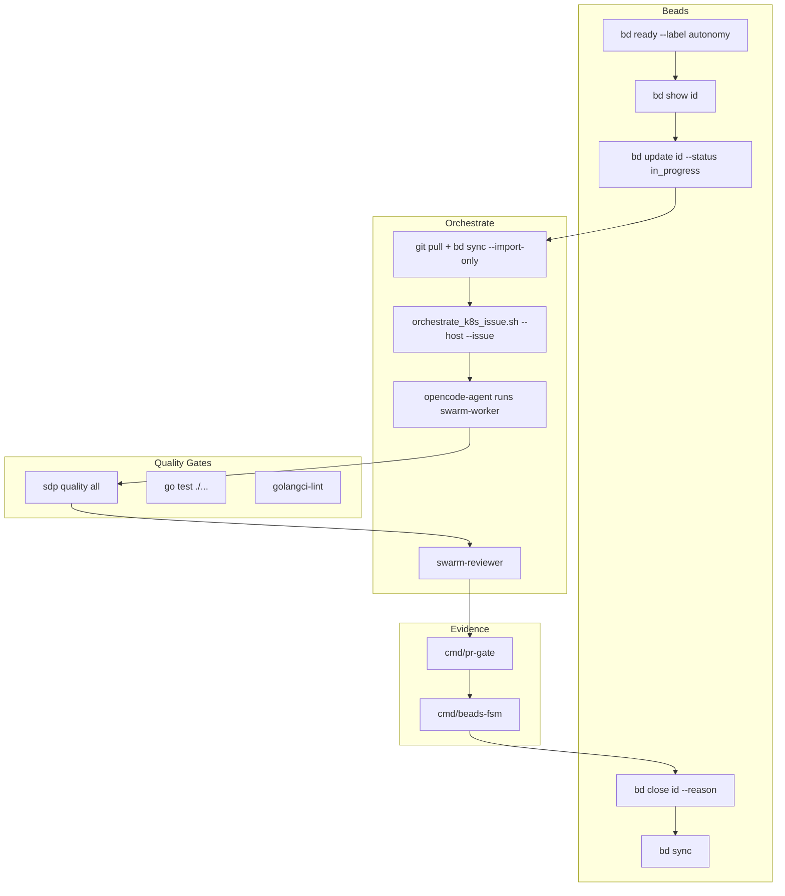

# SDP Operator Workflow

Status: reference
Scope: Beads + orchestrate + quality gates + evidence for operator tasks

## Overview

This document describes the SDP protocol workflow for conducting operator-related work: UP-001 (kubeopencode upstream), O2 AgentRun implementation, and related tasks.

## Workflow Diagram



## Sequence

1. **Find work:** `bd ready --label autonomy --label workstream:kubeopencode-upstream` (or `workstream:agentrun-operator`)
2. **Get context:** `bd show <id>`
3. **Claim:** `bd update <id> --status in_progress`
4. **Dispatch:** Locally or via `scripts/orchestrate_k8s_issue.sh --host <user@ip> --issue <id>`
5. **In pod:** git pull, `bd sync --import-only`, swarm-worker executes task
6. **Quality:** `sdp quality all`, `go test ./...`
7. **Evidence:** strict evidence, `cmd/pr-gate`, `cmd/beads-fsm`
8. **Complete:** `bd close <id> --reason "..."`, `bd sync`

## Workstreams

| Workstream | Paths | Use case |
|------------|-------|----------|
| `workstream:kubeopencode-upstream` | docs/, specs/, scripts/, internal/adapter/ | UP-001 fixes, adapter changes |
| `workstream:agentrun-operator` | internal/controller/, api/, deploy/k8s/, docs/, specs/, scripts/ | O2 AgentRun CRD, controller, RBAC |

## Orchestrate Script

```bash
scripts/orchestrate_k8s_issue.sh --host <user@ip> --issue <beads-id> [--timeout 300] [--retries 3]
```

Preflight: git pull, bd sync --import-only, then exec into opencode-agent pod to run swarm-worker.

## Quality Gates

- `make quality` or `sdp quality all` — SDP plugin checks
- `go test ./...` — unit and integration tests
- `golangci-lint run` — lint

## Evidence

- Strict evidence: `specs/strict-evidence-template.json` sections
- `cmd/pr-gate` — validates trace before PR
- `cmd/beads-fsm` — protocol flow state transitions

## References

- [BEADS_AUTONOMY_SPEC.md](BEADS_AUTONOMY_SPEC.md)
- [BEADS_SDP_REQUIREMENTS.md](BEADS_SDP_REQUIREMENTS.md)
- [K8S_OPERATOR_BACKLOG_PLAN.md](K8S_OPERATOR_BACKLOG_PLAN.md)
- [docs/UP_001_WORK_PLAN.md](UP_001_WORK_PLAN.md)
