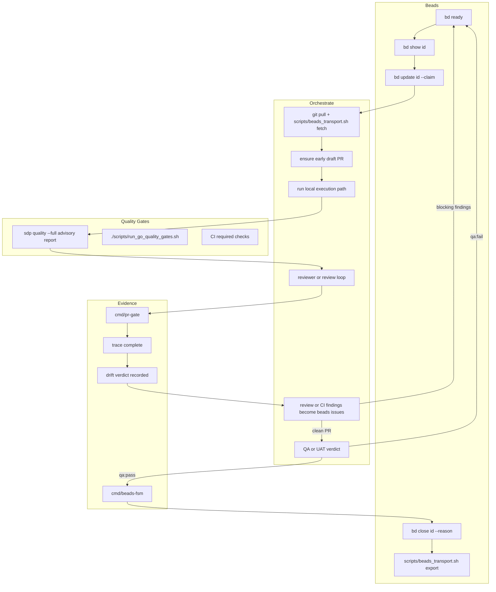

# SDP Operator Workflow

Status: reference
Scope: Operator Mode workflow for `feature` -> `workstream` -> `beads` -> PR -> `QA/UAT`

## Overview

This document describes the Operator Mode slice of the canonical SDP happy path.

Use this doc when:

- work is already entering a board-backed queue
- `Beads` is the operational source of truth
- the question is how SDP moves an item through execution, findings, `QA/UAT`, and delivery

Do not use this doc as first-run onboarding for repo adoption.
For the stable system story, start with [reference/canonical-happy-path.md](reference/canonical-happy-path.md).

Canonical design references:

- [../AGENTS.md](../AGENTS.md)
- [reference/project-map.md](reference/project-map.md)
- [reference/canonical-happy-path.md](reference/canonical-happy-path.md)
- [plans/2026-04-05-canonical-sdp-happy-path-consistency.md](archive/plans/2026-04-05-canonical-sdp-happy-path-consistency.md)

## Workflow Diagram

## Default Loop

The default Operator Mode path in `sdp_lab` is Beads-backed and PR-driven.

- shape work in `feature` and `workstream`
- use Beads as the durable execution graph
- branch from `main`
- open an early draft PR
- run local execution and verification
- feed findings back into Beads
- finish with `QA/UAT` and a clean PR

K8s, swarm, and NATS flows are background or optional execution environments, not the default operator starting point.

Roadmap and workstream docs set planning priority. Beads is still the live execution graph. If `bd ready` disagrees with a planning doc, fix the planning doc or file a Beads follow-up instead of freelancing from stale text.

Board semantics:

- `Beads` is the operational source of truth
- board and status surfaces are derived projections
- this doc assumes the queue already exists and is visible through Beads-backed state

## Sequence

1. **Shape `feature`:** confirm linked `workstream` and acceptance are clear enough to execute.
2. **Find ready work:** `bd ready` (`bd ready` is authoritative for executable work; roadmap/index are not a substitute for the live queue)
3. **Get context:** `bd show <id>`
4. **Claim:** `bd update <id> --claim`
5. **Preflight:** `git pull`, `scripts/beads_transport.sh fetch`, confirm branch and linked `PR` state.
6. **Open early `draft PR`:** create or re-use the feature `PR` at the first blocking `workstream` or first meaningful change.
7. **Execute:** use the local operator path unless a workstream explicitly requires swarm or remote infrastructure.
8. **Record artifacts:** execution must produce `evidence`, `trace`, and `drift` inputs.
9. **Quality gates:** `./scripts/run_go_quality_gates.sh`, CI required checks, and any workstream-specific verification. Use `sdp quality` for the fast F168 state matrix and `sdp quality --full` for the local advisory evidence report; neither replaces the blocking Go/CI gates.
10. **Review loop:** reviewer validates output; any review, CI, or `drift` finding becomes a typed `beads issue` with `source`, linked `feature`, linked `workstream`, `blocking`, and `PR` or artifact reference.
11. **`QA/UAT`:** after engineering gates are clean, run `QA/UAT` against the `feature` intent. `qa:fail` creates new blocking `beads issue`; `qa:pass` records `UAT evidence`.
12. **Complete:** `cmd/beads-fsm` moves flow to `verified` and `done`, then `bd close <id> --reason "..."`, `scripts/beads_transport.sh export`.

## Findings Loop

All findings must re-enter execution as `beads issue` entries.

Required finding metadata:

- `source = review | ci | drift | qa`
- linked `feature`
- linked `workstream`
- `blocking = true|false`
- `PR` link or artifact reference

Contract reference:

- [protocol/BEADS_FINDINGS_CONTRACT.md](protocol/BEADS_FINDINGS_CONTRACT.md)

The operator loop is not complete until all blocking findings are resolved and the active `PR` is clean.

## Optional Runtime Paths

Use these only when the workstream explicitly requires them:

- swarm or K8s execution
- NATS-backed intake flows
- remote `orchestrate_k8s_issue.sh` execution
- operator-controller development under `deploy/`, `api/`, or `internal/controller/`

If none of those are true, stay on the local path.

## Quality Gates

- `./scripts/run_go_quality_gates.sh` — build, tests, vet, and lint
- CI required checks — remote merge gate
- `sdp quality --full` — local advisory quality-axis evidence; not a merge gate by itself

## Evidence

- Strict evidence: `specs/strict-evidence-template.json` sections
- `cmd/pr-gate` — validates trace before PR progression and before merge-ready state
- `cmd/beads-fsm` — protocol flow state transitions
- `trace` must link `feature -> workstream -> beads issue -> branch -> PR -> evidence`
- `drift` verdict must be recorded before `QA/UAT`
- `QA/UAT` must produce either `qa:pass` with `UAT evidence` or `qa:fail` with blocking `beads issue`

## References

- [reference/project-map.md](reference/project-map.md)
- [BEADS_AUTONOMY_SPEC.md](BEADS_AUTONOMY_SPEC.md)
- [BEADS_SDP_REQUIREMENTS.md](BEADS_SDP_REQUIREMENTS.md)
- [K8S_OPERATOR_BACKLOG_PLAN.md](archive/k8s/K8S_OPERATOR_BACKLOG_PLAN.md)
- [AGENT_HOOKS_SPEC.md](AGENT_HOOKS_SPEC.md)
- [AGENT_SKILLS_SPEC.md](AGENT_SKILLS_SPEC.md)
- [PROJECT_REGISTRY_SPEC.md](PROJECT_REGISTRY_SPEC.md)
- [docs/UP_001_WORK_PLAN.md](UP_001_WORK_PLAN.md)
