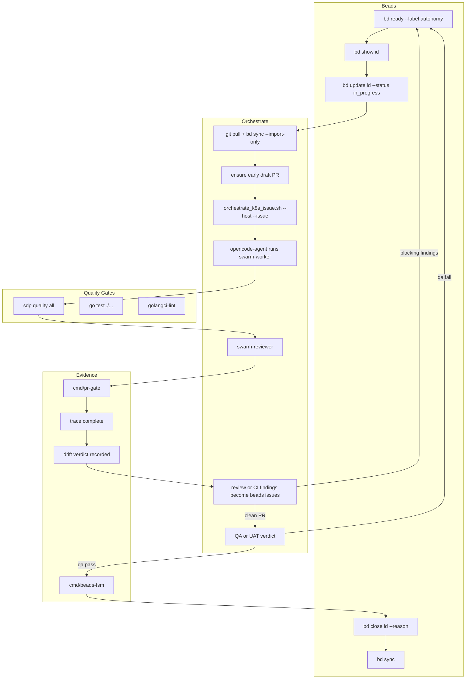

# SDP Operator Workflow

Status: reference
Scope: Beads + orchestrate + quality gates + evidence + `QA/UAT` for operator tasks

## Overview

This document describes the canonical SDP operator loop for conducting work through linked `feature`, `workstream`, `beads issue`, `evidence`, `trace`, `drift`, and `PR` state.

Canonical design references:

- [../AGENTS.md](../AGENTS.md)
- [plans/2026-03-15-canonical-sdp-loop-and-agent-stack.md](plans/2026-03-15-canonical-sdp-loop-and-agent-stack.md)

## Workflow Diagram



## NATS Flow (Swarm Platform)

When the swarm platform is deployed, intake and lifecycle flow through NATS:

```mermaid
flowchart LR
    Intake[POST /api/v1/intake] --> Gateway[intake-gateway]
    Gateway -->|publish| NATS[(NATS JetStream)]
    NATS -->|sdp.intake.{project}| Orchestrator[swarm-orchestrator]
    Orchestrator -->|dispatch| Coder[role-agent-coder]
    Orchestrator -->|dispatch| Analyst[role-agent-analyst]
    Coder -->|sdp.lifecycle.>| NATS
    Analyst -->|sdp.lifecycle.>| NATS
```

- **Subjects:** `sdp.intake.{projectID}` (intake), `sdp.lifecycle.>` (lifecycle events)
- **Stream:** `SDP_INTAKE` (JetStream)
- **KEDA:** Scales coder/analyst agents by consumer lag

## Sequence

1. **Shape `feature`:** confirm linked `workstream` and acceptance are clear enough to execute.
2. **Find ready work:** `bd ready --label autonomy --label workstream:kubeopencode-upstream` (or `workstream:agentrun-operator`)
3. **Get context:** `bd show <id>`
4. **Claim:** `bd update <id> --status in_progress`
5. **Preflight:** git pull, `bd sync --import-only`, confirm branch and linked `PR` state.
6. **Open early `draft PR`:** create or re-use the feature `PR` at the first blocking `workstream` or first meaningful change.
7. **Dispatch execution:** locally or via `scripts/orchestrate_k8s_issue.sh --host <user@ip> --issue <id>`
8. **In pod:** swarm-worker executes the task and records `evidence`, `trace`, and `drift` inputs.
9. **Quality gates:** `sdp quality all`, `go test ./...`, lint, and any workstream-specific verification.
10. **Review loop:** reviewer validates output; any review, CI, or `drift` finding becomes a typed `beads issue` with `source`, linked `feature`, linked `workstream`, `blocking`, and `PR` or artifact reference.
11. **`QA/UAT`:** after engineering gates are clean, run `QA/UAT` against the `feature` intent. `qa:fail` creates new blocking `beads issue`; `qa:pass` records `UAT evidence`.
12. **Complete:** `cmd/beads-fsm` moves flow to `verified` and `done`, then `bd close <id> --reason "..."`, `bd sync`.

## Findings Loop

All findings must re-enter execution as `beads issue` entries.

Required finding metadata:

- `source = review | ci | drift | qa`
- linked `feature`
- linked `workstream`
- `blocking = true|false`
- `PR` link or artifact reference

Contract reference:

- [protocol/BEADS_FINDINGS_CONTRACT.md](protocol/BEADS_FINDINGS_CONTRACT.md)

The operator loop is not complete until all blocking findings are resolved and the active `PR` is clean.

## Workstreams

| Workstream | Paths | Use case |
|------------|-------|----------|
| `workstream:kubeopencode-upstream` | docs/, specs/, scripts/, internal/adapter/ | UP-001 fixes, adapter changes |
| `workstream:agentrun-operator` | internal/controller/, api/, deploy/k8s/, docs/, specs/, scripts/ | O2 AgentRun CRD, controller, RBAC |

## Orchestrate Script

```bash
scripts/orchestrate_k8s_issue.sh --host <user@ip> --issue <beads-id> [--timeout 300] [--retries 3]
```

Preflight: git pull, bd sync --import-only, then exec into opencode-agent pod to run swarm-worker.

## Quality Gates

- `make quality` or `sdp quality all` — SDP plugin checks
- `go test ./...` — unit and integration tests
- `golangci-lint run` — lint

## Evidence

- Strict evidence: `specs/strict-evidence-template.json` sections
- `cmd/pr-gate` — validates trace before PR progression and before merge-ready state
- `cmd/beads-fsm` — protocol flow state transitions
- `trace` must link `feature -> workstream -> beads issue -> branch -> PR -> evidence`
- `drift` verdict must be recorded before `QA/UAT`
- `QA/UAT` must produce either `qa:pass` with `UAT evidence` or `qa:fail` with blocking `beads issue`

## References

- [BEADS_AUTONOMY_SPEC.md](BEADS_AUTONOMY_SPEC.md)
- [BEADS_SDP_REQUIREMENTS.md](BEADS_SDP_REQUIREMENTS.md)
- [K8S_OPERATOR_BACKLOG_PLAN.md](K8S_OPERATOR_BACKLOG_PLAN.md)
- [AGENT_HOOKS_SPEC.md](AGENT_HOOKS_SPEC.md)
- [AGENT_SKILLS_SPEC.md](AGENT_SKILLS_SPEC.md)
- [PROJECT_REGISTRY_SPEC.md](PROJECT_REGISTRY_SPEC.md)
- [docs/UP_001_WORK_PLAN.md](UP_001_WORK_PLAN.md)
