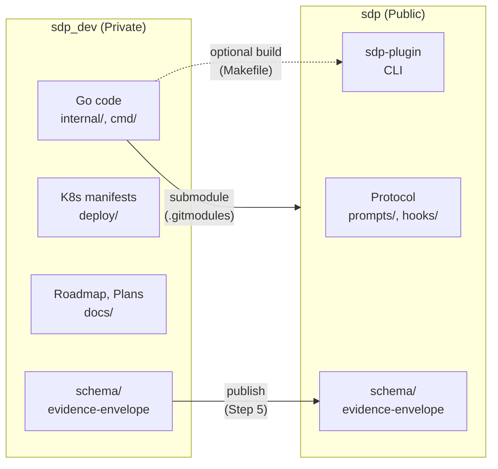
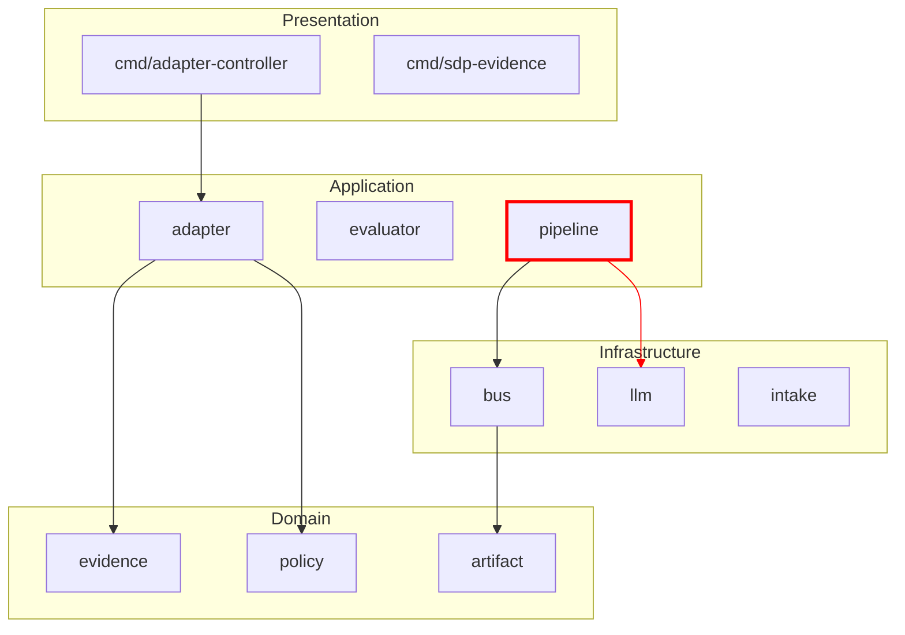

# @reality — Multi-Repo Technical Audit Redesign

> **Status:** Research complete
> **Date:** 2026-02-23
> **Goal:** Превратить @reality из single-repo health checker в комплексный multi-repo технический аудитор с 9-pager отчётом, mermaid-диаграммами и actionable рекомендациями

---

## Overview

### Goals

1. **Multi-repo audit** — обнаружение и анализ всех репозиториев (root + submodules) без ручной конфигурации
2. **Repository identity** — определение назначения, роли и зоны ответственности каждого репо
3. **Relationship mapping** — визуализация связей между репо (submodules, shared artifacts, dependency direction)
4. **Documentation audit** — свежесть, покрытие, дрифт, кросс-репо консистентность со скоркартой
5. **Architecture audit** — слои, нарушения, циклы, coupling, tech debt с mermaid-диаграммами
6. **Git/commit hygiene** — конвенции коммитов, бранчинг, PR шаблоны, release паттерны
7. **9-pager report** — dual-mode (human + machine-readable) отчёт с mermaid
8. **Backward compatibility** — single-repo режим сохранён, multi-repo аддитивен

### Key Decisions

| Aspect | Decision |
|--------|----------|
| Multi-repo discovery | Git submodules only: `.gitmodules` + root = repo list |
| Repo purpose analysis | Hybrid: manifest first (AGENTS.md, MANIFESTO.md), structural fallback |
| Relationship mapping | Hybrid: submodules + shared artifact detection + drift validation |
| Documentation audit | Layered Scorecard: Quality + Freshness + Coverage + Consistency |
| Architecture audit | Hybrid: layers + boundaries + tech-debt signals |
| Git hygiene | Scored rubric + pattern-based findings |
| Report format | Dual-mode 9-pager (human narrative + machine blocks) |
| Skill boundaries | Layered model: @reality = audit, @review = gate |
| Backward compat | Additive flags: --repos, --audit, --format=9pager |

---

## 1. Multi-repo Discovery & Enumeration

> **Experts:** Kelsey Hightower, Charity Majors, Sam Newman

### Solution

Git submodules as the canonical source. Root repo always included. `.gitmodules` parsed for submodule paths. No manual config needed.

**Algorithm:**

```bash
REPOS=(".")
if [ -f ".gitmodules" ]; then
  while IFS= read -r path; do
    [ -n "$path" ] && REPOS+=("$path")
  done < <(git config --file .gitmodules --get-regexp '^submodule\..*\.path$' | awk '{print $2}')
fi
# For sdp_dev: REPOS = [".", "sdp"]
```

Per repo: auto-detect project type (go.mod, package.json, etc.), then run analysis pipeline.

| Aspect | Details |
|--------|---------|
| Default | Root only (single-repo backward compat) |
| Multi-repo trigger | `--repos=auto` (submodules) or `--repos=path1,path2` |
| Uninitialized submodules | Skip with warning |
| Nested submodules | `--recursive` flag (future) |

### Risks
- Uninitialized submodules need graceful handling
- Non-submodule siblings require explicit `--repos=` flag

---

## 2. Repository Purpose & Role Analysis

> **Experts:** Sam Newman, Rob Pike, Martin Fowler

### Solution

Hybrid: manifest-first, structural fallback. Two-step flow:

**Step 1 — Manifest:** Look for AGENTS.md, MANIFESTO.md, README.md. Extract: purpose, role, ownership, change cadence.

**Step 2 — Structure (if manifest absent/incomplete):** Infer from layout:

| Signal | Inferred Role |
|--------|---------------|
| `internal/` + `cmd/` + `go.mod` | Implementation / runtime |
| `prompts/` + `schema/` + no `internal/` | Protocol / spec |
| `deploy/` + K8s manifests | Operations |
| Submodule (not root) | Dependency / library |
| `docs/roadmap/` + `docs/workstreams/` | Planning hub |

**Step 3 — Confidence:** Report confidence level and gaps.

**Output per repo:**

```markdown
### Repository: sdp (submodule)
- **Purpose:** Protocol specification (prompts, JSON schemas, hooks)
- **Role:** Public spec dependency consumed by sdp_dev
- **Ownership:** Protocol artifacts
- **Change cadence:** Rare (only when protocol spec changes)
- **Confidence:** HIGH (manifest + structure match)
```

### Risks
- Manifest drift: compare manifest claims with structure, flag mismatches
- Minimal vocabulary: purpose, role, ownership, change cadence — avoid over-specification

---

## 3. Inter-Repository Relationship Mapping

> **Experts:** Martin Kleppmann, Sam Newman, Theo Browne

### Solution

Hybrid: git-based discovery + automated validation.

**Detection sources:**

| Source | What it reveals |
|--------|----------------|
| `.gitmodules` | Submodule dependency direction |
| `go.mod` / `replace` | Module imports, local overrides |
| Shared paths (`schema/` ↔ `sdp/schema/`) | Artifact publish flow |
| `Makefile` / scripts | Build-time coupling |
| `.sdp/config.yml` exclusions | What's intentionally decoupled |

**Coupling classification:**

| Type | Strength | Example |
|------|----------|---------|
| Submodule | Structural | sdp as submodule in sdp_dev |
| Shared schema | Contract | `evidence-envelope.schema.json` |
| Build dependency | Optional | Makefile sdp-plugin quality target |
| Doc reference | Informational | MANIFESTO links to sdp_dev |

**Mermaid output:**



**Drift detection:** Compare `schema/*.json` (lab) vs `sdp/schema/*.json` (submodule) — flag if content diverges.

### Risks
- `.gitmodules` URL `../sdp` is local path, not production URL
- CI may not checkout submodules — flag as warning

---

## 4. Documentation Quality Audit

> **Experts:** Simon Willison, Andrej Karpathy, Charity Majors

### Solution

Layered Scorecard: четыре измерения, разные правила по типу документа.

### Scoring Dimensions

| Dimension | What to Measure | Score 0–100 |
|-----------|-----------------|-------------|
| **Quality** | Frontmatter valid, scope_files non-empty, AC present, no broken links | Structural checks per doc type |
| **Freshness** | `git log -1 --format="%ci" -- <path>` | Decay: 100 − (days × decay_factor) |
| **Coverage** | ROADMAP features → WS files; WS → scope_files; orphan docs | % expected docs present |
| **Consistency** | sdp_dev ↔ sdp; ROADMAP ↔ INDEX; CLI in docs vs `sdp --help` | Cross-ref + protocol-consistency |

### Document Tiers

| Tier | Documents | Freshness Threshold | Checks |
|------|-----------|---------------------|--------|
| **1 — Canonical** | MANIFESTO, ROADMAP, AGENTS, INDEX | < 14 days = Fresh | Must be linked, consistent, structural |
| **2 — Execution** | WS files (00-XXX-YY.md) | < 30 days | scope_files exist, AC present, drift PASS |
| **3 — Planning** | plans/, drafts/ | < 90 days | Freshness only, no drift check |
| **Cross-repo** | sdp/ README, PROTOCOL vs sdp_dev refs | < 30 days | Cross-reference validation |

### Staleness Detection

```bash
# Per-file freshness
DOC_DATE=$(git log -1 --format="%ci" -- "$DOC_PATH")
DAYS_AGO=$(( ($(date +%s) - $(date -d "$DOC_DATE" +%s)) / 86400 ))

# Code-doc drift: scope file modified after WS doc
CODE_DATE=$(git log -1 --format="%ci" -- "$SCOPE_FILE")
if [ "$CODE_DATE" > "$DOC_DATE" ]; then
  echo "WARNING: Code changed after doc — possible drift"
fi
```

### Risks
- Freshness decay can be gamed (trivial edits)
- `sdp drift detect` bug (`feature` vs `feature_id`) must be fixed before relying on it
- Cross-repo consistency requires explicit rules for submodule docs

---

## 5. Architecture Quality Audit

> **Experts:** Martin Fowler, Sam Newman, Rob Pike

### Solution

Hybrid: layer graph inside each repo + cross-repo boundary audit + tech-debt signals.

### Intra-repo: Layer Analysis (Go-specific)

| Layer | Packages (sdp_dev) |
|-------|--------------------|
| **Domain** | evidence, artifact, policy, beads (types) |
| **Application** | adapter, evaluator, pipeline |
| **Infrastructure** | bus, observability, intake, llm |
| **Presentation** | cmd/* |

**Detection:** Parse Go imports (`go list -deps`), build directed graph, detect violations (infra→domain, cycles).

### Cross-repo: Boundary Audit

| Check | Detection |
|-------|-----------|
| No code imports sdp_dev→sdp | `grep -r "sdp_dev" sdp/` |
| Shared schemas versioned | `$id` in JSON Schema files |
| Submodule pinned to release | `git submodule status` |

### Tech Debt Signals

| Signal | Detection | Threshold |
|--------|-----------|-----------|
| God packages (>10 dependents) | Afferent coupling count | >10 = flag |
| Large files (>200 LOC) | `wc -l` per file | >200 = flag |
| High complexity | Cyclomatic complexity | >15 = flag |
| TODO/FIXME density | `grep -c TODO\|FIXME` | >5 per file |
| Circular deps | Import graph cycle detection | Any = flag |

### Health Score

```
Architecture Score = 100
  - (layer_violations × 10)
  - (cycles × 20)
  - (god_packages × 5)
  - (large_files × 2)
  - (high_complexity_files × 3)
```

### Mermaid Output



Red edges = layer violations. Dashed = optional coupling.

### Risks
- Layer mapping requires initial heuristic; may need repo-specific config
- sdp-plugin is small; focus analysis depth on sdp_dev
- Mermaid diagrams can get large with 32+ packages; use `--focus=` for drill-down

---

## 6. Git/Commit Hygiene & Process Audit

> **Experts:** Charity Majors, Kelsey Hightower, Martin Fowler

### Solution

Scored rubric + pattern-based findings. Quick score for `--quick`, deep pattern report for `--deep`.

### Dimensions

| Dimension | What to Check | Score 0–100 |
|-----------|---------------|-------------|
| **Commit convention** | Type prefix, scope, subject length | % of last 30 commits matching regex |
| **Branch naming** | Match `feature/FXXX-*`, `fix/FXXX-*`, `docs/*` | % branches matching convention |
| **PR hygiene** | Template exists, issue templates exist | Binary (0/50/100) |
| **Release/tags** | Tag format `v*`, release workflow | Workflow + tags present |
| **Merge strategy** | Documented, consistent | AGENTS vs reality |
| **CI coverage** | Triggers on feature branches | `.github/workflows/*.yml` analysis |
| **Doc consistency** | AGENTS vs git-safety vs actual | Cross-reference conflicts |

### Commit Regex

```regex
^(feat|fix|docs|chore|test|ci|refactor|perf|build|style)(\([^)]+\))?: .{10,}$
```

### Patterns to Flag

| Pattern | Severity | Example |
|---------|----------|---------|
| Commit without type prefix | WARN | `F004: rewrite...` |
| `feat/` vs `feature/` mismatch | WARN | CI expects `feat/*`, docs say `feature/` |
| No PR template | WARN | Missing `.github/PULL_REQUEST_TEMPLATE.md` |
| Doc conflict (AGENTS vs git-safety) | WARN | `master` vs `dev` target |
| CI branch mismatch vs docs | ERROR | CI triggers on `feat/*`, docs say `feature/` |
| Force push on shared branch | ERROR | History rewrite |

### Risks
- Old branches/commits may skew scores — limit to last N commits and active branches
- Dual-repo needs separate commit convention analysis per repo
- Convention evolution: keep patterns configurable

---

## 7. 9-Pager Report Format

> **Experts:** Simon Willison, Andrej Karpathy, Charity Majors

### Solution

Dual-mode: human narrative + machine-readable blocks per page. Saved to `docs/reality/YYYY-MM-DD-reality-report.md`.

### Page Structure

| Page | Title | Human Content | Machine Block | Mermaid |
|------|-------|---------------|---------------|---------|
| 1 | Executive Summary | Verdict, top 3 blockers, health score | `health_score`, `verdict`, `blockers[]` | — |
| 2 | Repository Map | Repo purposes, roles, change cadence | `repos[]` with purpose/role/cadence | Repo relationship graph |
| 3 | Architecture | Layers, violations, patterns | `components[]`, `violations[]` | Layer dependency graph |
| 4 | Dependencies | Import structure, cycles, coupling | `deps[]`, `cycles[]`, `coupling[]` | Cross-repo dependency graph |
| 5 | Documentation | Scorecard by tier, freshness heatmap | `doc_scores{}`, `stale_docs[]` | — |
| 6 | Git & Process | Commit hygiene, branch conventions | `git_scores{}`, `findings[]` | Process flowchart |
| 7 | Health Metrics | Score breakdown by dimension, trends | `metrics{}`, `deltas{}` | — |
| 8 | Issues & Recommendations | Fix Now / This Week / This Month | `issues[]`, `actions[]` | — |
| 9 | Agent Context | Commands, resume hints, known drift | `suggested_commands[]`, `drift_warnings[]` | — |

### Machine Block Format

Embedded YAML block within each page:

```markdown
## 1. Executive Summary

This audit covers 2 repositories...

<!-- machine-context
health_score: 72
verdict: proceed_with_caution
blockers:
  - "Architecture: 3 layer violations in adapter→evidence"
  - "Documentation: ROADMAP stale (45 days)"
repos_scanned: [".", "sdp"]
timestamp: "2026-02-23T14:00:00Z"
-->
```

### Quick vs Deep Output

| Mode | Pages Produced |
|------|----------------|
| `--quick` | Pages 1, 7, 9 (Executive + Metrics + Agent Context) |
| `--deep` | All 9 pages |
| `--focus=X` | Pages 1, X-specific page, 9 |
| `--format=9pager` | Full 9-pager regardless of mode depth |

### Risks
- Duplication between narrative and machine blocks — keep machine blocks as derived views
- Mermaid diagram size — cap at 20 nodes per diagram, use `--focus` for drill-down
- Schema for machine blocks should be versioned

---

## 8. Skill Decomposition & Overlap Resolution

> **Experts:** Andrej Karpathy, Thorsten Ball, Andrew Ng

### Solution

Layered model: **Audits** answer "what is the state?", **Gates** answer "can we proceed?"

### Responsibility Matrix

| Skill | Layer | Scope | Output | When |
|-------|-------|-------|--------|------|
| **@reality** | Audit | Full codebase / multi-repo | 9-pager report, health score | Discovery, quarterly, before @feature |
| **@reality-check** | Micro-audit | Single file | Match/mismatch table | In-conversation (~90s) |
| **@verify-workstream** | Gate | Workstream | PAUSE/PROCEED | Pre-@build |
| **@review** | Gate | Feature | APPROVED/CHANGES_REQUESTED + beads | Post-build, pre-PR |
| **@protocol-consistency** | Meta-audit | CLI/docs/CI | Mismatch report | Suspected process drift |

### Boundary Rules

- **@reality** — read-only audit. No verdict, no beads, no blocking. Answers "what's the state?"
- **@review** — gate with verdict. Beads findings, blocking_ids. Answers "can we ship?"
- **@reality-check** — quick micro-audit for in-conversation use
- **@verify-workstream** — pre-build gate, delegates to `sdp drift detect`
- **@protocol-consistency** — meta-level process audit (CLI ↔ docs ↔ CI)

### What Changes in Related Skills

| Skill | Change |
|-------|--------|
| **@reality** | Major rewrite (this document) |
| **@reality-check** | No change — stays as micro-audit |
| **@review** | No structural change; Documentation Expert's drift work is clearly scoped to AC coverage |
| **@verify-workstream** | No change — pre-build gate |
| **@protocol-consistency** | No change — meta-audit; @reality can invoke it as sub-analysis |

### Risks
- Users may ask "@reality or @review?" — add decision tree to each skill's When to Use section
- @reality and @review share expert dimensions but differ in purpose — this overlap is intentional

---

## 9. Backward Compatibility & Modes

> **Experts:** Theo Browne, Rob Pike, Sam Newman

### Solution

Additive flags. All existing invocations work unchanged.

### Mode Table

| Invocation | Behavior |
|------------|----------|
| `@reality` | Quick single-repo scan (current behavior) |
| `@reality --quick` | Quick single-repo scan (explicit) |
| `@reality --deep` | Deep single-repo scan with 8+ experts |
| `@reality --focus=security` | Single expert deep dive |
| `@reality --deep --format=9pager` | **NEW:** Full 9-pager report |
| `@reality --deep --repos=auto` | **NEW:** Multi-repo (submodules auto-detected) |
| `@reality --deep --repos=auto --format=9pager` | **NEW:** Full multi-repo 9-pager |
| `@reality --audit=doc` | **NEW:** Documentation audit only |
| `@reality --audit=doc,arch,git` | **NEW:** Multiple focused audits |
| `@reality --output=docs/reality/report.md` | **NEW:** Save report to file |

### New Flags

| Flag | Values | Default | Effect |
|------|--------|---------|--------|
| `--repos` | `auto`, `path1,path2` | `.` (cwd only) | Multi-repo scope |
| `--audit` | `doc`, `arch`, `git` (comma-separated) | none (all in --deep) | Focus on specific audit type |
| `--format` | `markdown`, `9pager` | `markdown` | Output structure |
| `--output` | file path | none (inline) | Save to file |

### Precedence Rules

1. `--focus=X` sets the primary lens (single expert); `--audit=Y` adds additional analysis on top
2. `--format=9pager` produces 9-page structure regardless of `--quick`/`--deep`
3. `--repos=auto` expands scope; per-repo analysis runs independently, then synthesis
4. Without `--repos`, behavior is identical to current v2.0.0

### Risks
- Flag explosion if more audit types are added — consider presets later (`--preset=quarterly`)
- `--audit` + `--focus` interaction needs documentation

---

## Новая структура @reality Expert Agents

### Expert Mapping

| # | Expert | Current | New (additions) |
|---|--------|---------|-----------------|
| 1 | ARCHITECTURE | Layer mapping, deps, violations | + cross-repo boundaries, mermaid |
| 2 | CODE QUALITY | File size, complexity, duplication | No change |
| 3 | TESTING | Coverage, test quality, frameworks | No change |
| 4 | SECURITY | Secrets, OWASP, dependencies | No change |
| 5 | PERFORMANCE | Bottlenecks, caching, scalability | No change |
| 6 | DOCUMENTATION | Coverage, drift, quality | **Rewrite:** layered scorecard, tiers, cross-repo |
| 7 | TECHNICAL DEBT | TODO/FIXME, code smells | No change |
| 8 | STANDARDS | Conventions, error handling, types | No change |
| 9 | **GIT HYGIENE** | — | **NEW:** commits, branches, PR, release |
| 10 | **REPO IDENTITY** | — | **NEW:** purpose, role, relationships |

For multi-repo mode: experts 1, 6, 9, 10 run per-repo AND cross-repo. Experts 2-5, 7-8 run per-repo only.

---

## Предлагаемый workflow @reality v3.0

```
@reality [--quick|--deep] [--repos=auto] [--format=9pager] [--output=path]

Step 0: Parse flags, determine scope
  ├── Single repo (default) or multi-repo (--repos)
  └── Quick (default) or deep or focus

Step 1: Discover repos
  ├── Parse .gitmodules (if --repos=auto)
  ├── Verify submodule paths exist
  └── Auto-detect project type per repo

Step 2: Analyze repo identity (per repo)
  ├── Manifest scan (AGENTS.md, MANIFESTO.md, README)
  ├── Structural inference (dirs, files, patterns)
  └── Confidence rating

Step 3: Map relationships (multi-repo only)
  ├── Submodule links
  ├── Shared artifacts (schema/ ↔ sdp/schema/)
  ├── Import graph (go.mod, replace)
  └── Drift detection on shared artifacts

Step 4: Spawn expert agents (parallel, max 4)
  ├── Quick: 3 experts (Architecture, Documentation, Quick Stats)
  ├── Deep: 10 experts (all)
  ├── Focus: 1-2 experts
  └── Each expert runs per-repo, then cross-repo synthesis

Step 5: Synthesize report
  ├── --format=markdown: current output style
  └── --format=9pager: dual-mode 9-pager

Step 6: Output
  ├── Inline (default)
  └── --output=path: save to file
```

---

## Implementation Plan

### Phase 1: Core Skill Rewrite

- [ ] Rewrite Step 0: flag parsing (--repos, --audit, --format, --output)
- [ ] Add Step 1: multi-repo discovery from .gitmodules
- [ ] Add Step 2: repo identity analysis (manifest + structural)
- [ ] Add Step 3: relationship mapping (submodules, shared artifacts, drift)
- [ ] Rewrite Step 4: expand from 8 to 10 expert agents
- [ ] Add GIT HYGIENE expert (#9) prompts
- [ ] Add REPO IDENTITY expert (#10) prompts
- [ ] Rewrite DOCUMENTATION expert (#6) with layered scorecard
- [ ] Update ARCHITECTURE expert (#1) with cross-repo boundaries + mermaid

### Phase 2: 9-Pager Output

- [ ] Define 9-page structure in skill
- [ ] Add machine-readable YAML blocks per page
- [ ] Add mermaid diagram templates (architecture, dependencies, process)
- [ ] Add --format=9pager synthesis logic
- [ ] Add --output=path file writing

### Phase 3: Backward Compat Validation

- [ ] Verify `@reality` (no flags) produces current output
- [ ] Verify `@reality --quick` unchanged
- [ ] Verify `@reality --deep` unchanged
- [ ] Verify `@reality --focus=security` unchanged
- [ ] Test `@reality --deep --repos=auto --format=9pager` end-to-end

### Phase 4: Related Skills Updates

- [ ] @reality-check: add "See Also" link to @reality, clarify scope boundary
- [ ] @review: clarify gate vs audit distinction in When to Use
- [ ] @protocol-consistency: document that @reality can invoke as sub-analysis
- [ ] CLAUDE.md: update decision tree with new flags

---

## Success Metrics

| Metric | Baseline | Target |
|--------|----------|--------|
| Repos analyzed per run | 1 | All submodules (auto) |
| Expert agents | 8 | 10 |
| Output format options | 1 (markdown) | 2 (markdown + 9-pager) |
| Documentation scoring | None | 4-dimension scorecard |
| Git hygiene scoring | None | 7-dimension rubric |
| Mermaid diagrams in report | 0 | 3-5 per deep run |
| Machine-readable blocks | 0 | 9 (one per page) |
| Backward compat breaks | — | 0 |

---

## See Also

- `.cursor/skills/reality/SKILL.md` — текущий skill (v2.0.0)
- `.cursor/skills/reality-check/SKILL.md` — micro-audit (без изменений)
- `.cursor/skills/review/SKILL.md` — gate skill (минорные уточнения)
- `.cursor/skills/protocol-consistency/SKILL.md` — meta-audit (без изменений)
- `.cursor/skills/verify-workstream/SKILL.md` — pre-build gate (без изменений)
- `docs/plans/2026-02-23-oneshot-autonomous-design.md` — дизайн @oneshot
