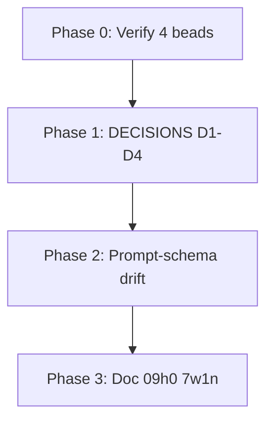

# План: Устранение проблем и актуализация beads

**Дата:** 2026-02-25  
**Источники:** audit_beads_remediation (выполнен), sdp_review_fixes, audit-gaps-design, AUDIT-ENGINEERING-GAPS  
**Правило:** После каждого исправления — `bd close <id>`

**Статус:** ✅ Выполнено (Phase 0–3)

---

## Phase 0: Verify & Close (уже исправлено) — DONE

Проверить код и закрыть beads, если фикс присутствует:

| Bead | Finding | Проверка | Действие |
|------|---------|----------|----------|
| sdp_dev-r1wb | Verifier coverage not wired | verifier.go:124–166 вызывает checker.CheckCoverage | `bd close sdp_dev-r1wb` |
| sdp_dev-udlg | Config timeouts ignored | retry.go:69–79, verifier verificationTimeout() | `bd close sdp_dev-udlg` |
| sdp_dev-8jj0 | ac_evidence format drift | build/SKILL.md:89 — `{"ac","met","evidence"}` | `bd close sdp_dev-8jj0` |
| sdp_dev-a9i0 | CHECK EXISTING CODE not formalized | existing_work_summary в required, build SKILL | `bd close sdp_dev-a9i0` |

---

## Phase 1: DECISIONS.md (sdp_dev-cnbk, sdp_dev-17t9) — DONE

**Файл:** [sdp/docs/decisions/DECISIONS.md](https://github.com/fall-out-bug/sdp/blob/main/docs/decisions/DECISIONS.md)

**Проблема:** Только JWT; D1–D4 из design doc не задокументированы.

**Действия:**
1. Добавить D1: Evidence singleton + flock (Question, Decision, Rationale, Alternatives)
2. Добавить D2: in-toto v1, predicate schema, snake_case
3. Добавить D3: Inverted architecture — enforcement в CLI/schemas
4. Добавить D4: Go quality plan (P0–P2)
5. `bd close sdp_dev-cnbk` и `bd close sdp_dev-17t9`

---

## Phase 2: Prompt–Schema Drift (sdp_dev-ho9y, sdp_dev-z2ce) — DONE (schema already had blocking_ids/summary)

**Проблема:** JSON example в @review имеет `blocking_ids`, `summary` — схема review-verdict имеет `finding_ids`. Несоответствие.

**Действия:**
1. В [review-verdict.schema.json](sdp/schema/review-verdict.schema.json): добавить `blocking_ids`, `summary` как optional, если нужны для обратной совместимости
2. Или в [review/SKILL.md](sdp/prompts/skills/review/SKILL.md): убрать из example поля, которых нет в схеме
3. Выбрать один подход, выровнять
4. `bd close sdp_dev-ho9y` и `bd close sdp_dev-z2ce`

---

## Phase 3: P2 / Document Only — DONE

| Bead | Finding | Действие |
|------|---------|----------|
| sdp_dev-09h0 | flock UNIX only | ✅ README Platform section added → closed |
| sdp_dev-7w1n | Config schema incomplete | ✅ config.schema.json extended → closed |

---

## Phase 4: Out of Scope / Backlog

| Bead | Причина |
|------|---------|
| sdp_dev-dg5t | Verifier interface — рефакторинг, не блокер |
| sdp_dev-tjq8 | TDD artifact — @oneshot в sdp_dev |
| sdp_dev-vwgy | @vision output — skill в sdp_dev |
| sdp_dev-0cgy | Parser bug — отдельный фикс |
| sdp_dev-8ds3 | @deploy — в sdp_dev |
| sdp_dev-l0i3 | Git safety — уже есть sdp guard activate |
| sdp_dev-ppha | intent schema — уже расширен |
| sdp_dev-2mu6 | PromptOps checks — backlog |
| sdp_dev-zq8l | Schema path — backlog |
| sdp_dev-mt0x | @oneshot advance — skill в sdp_dev |

**Действие:** Для backlog — `bd update <id> --status backlog` или оставить open с label.

---

## Порядок выполнения



**Рекомендуемый порядок:** Phase 0 (verify + close 4) → Phase 1 → Phase 2 → Phase 3

---

## Quality Gates

После каждой фазы:

```bash
cd sdp/sdp-plugin && go build ./...
bd sync
```

---

## Landing

1. Все целевые beads закрыты (Phase 0–3)
2. `bd sync`
3. `git add -A && git commit && git push` (per AGENTS.md)
