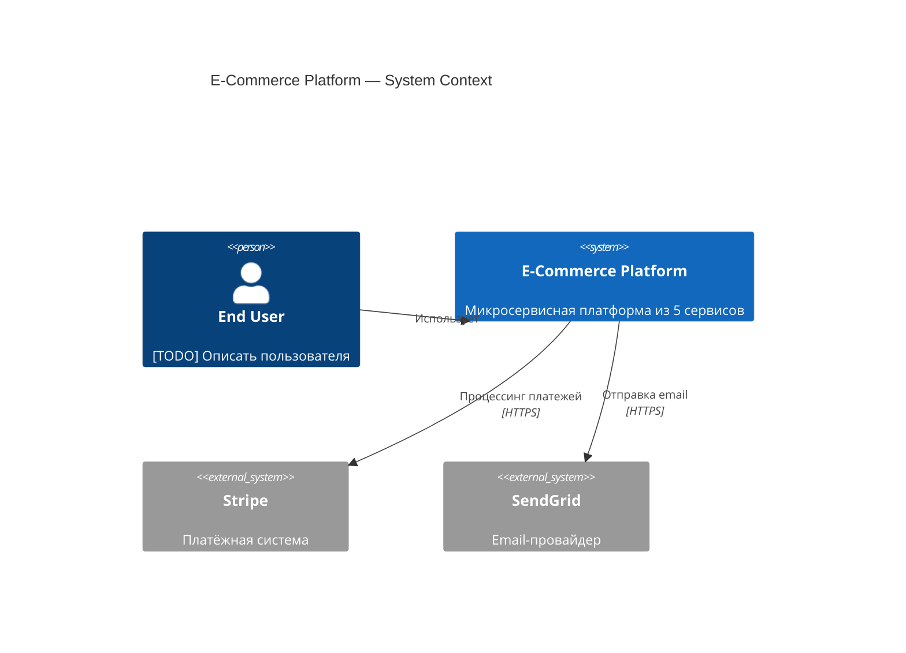

# AI Architect — Спецификация модуля

**Дата:** 2026-04-10
**Версия:** 3.1
**Статус:** Проектирование (прошло peer review 7 моделей)

---

## 1. Назначение

AI Architect — компонент платформы SDP, который делает **архитектурный снимок** (architectural snapshot) любого внешнего репозитория и помогает команде документировать, понимать и контролировать архитектуру проекта.

Это **не детектор архитектуры** — он формирует **гипотезы** с оценкой уверенности и доказательствами. Окончательное решение всегда за человеком.

### 1.1 Основной сценарий: снятие архитектурного среза

Разработчик, архитектор или tech lead указывает инструменту на репозиторий:

```bash
sdp architect analyze /path/to/target-repo
```

Через 1-6 минут (в зависимости от размера) инструмент выдаёт полный **архитектурный срез** — структурированный набор артефактов, описывающих текущее состояние архитектуры проекта на момент анализа.

### 1.2 Зачем это нужно

| Ситуация | Боль без инструмента | Что даёт AI Architect |
|----------|---------------------|----------------------|
| **Онбординг нового разработчика** | Неделя на чтение кода и расспросы коллег | Архитектурный отчёт + C4 диаграммы за минуты |
| **Due diligence / аудит** | Ручной анализ кодовой базы неделями | Автоматический срез с рисками и паттернами |
| **Подготовка brownfield к AI** | Непонятно, с чего начинать | Карта компонентов, контрактов и точек входа |
| **Архитектурный дрифт** | Код разъехался с замыслом, но никто не заметил | Conformance check в CI ловит нарушения |
| **Новый проект (greenfield)** | Архитектурные решения принимаются устно и теряются | Guided conversation → ADR + C4 + контракты с первого дня |
| **Передача проекта между командами** | "Тут всё в голове у Пети" | Машиночитаемая модель архитектуры в репо |

---

## 2. Выходные артефакты: что производит архитектурный срез

При запуске `sdp architect analyze` инструмент создаёт в целевом репозитории директорию `.sdp/architecture/` с полным набором артефактов.

### 2.1 Обзор артефактов

```
{target-repo}/
  .sdp/architecture/
    report.json                    # Главный отчёт — архитектурная гипотеза
    codebase-profile.json          # Структурный профиль кодовой базы
    reference-model.yaml           # Модель архитектуры (C4-ориентированная)
    contract-catalog.json          # Реестр обнаруженных контрактов
    conformance.json               # Результат проверки соответствия (если есть правила)
    conformance-rules.yaml         # Правила соответствия (создаются или обновляются)
    repo-index.json                # Индекс партиций с хешами для инкрементального анализа
    conversation-state.json        # Состояние greenfield-разговора (если применимо)
    c4/
      level-1-context.mmd          # C4 Level 1: системный контекст (Mermaid)
      level-2-containers.mmd       # C4 Level 2: контейнеры (Mermaid)
      level-3-{container}.mmd      # C4 Level 3: компоненты внутри контейнера
    sql/
      schema-snapshot.json         # Снимок схемы БД (таблицы, FK, индексы)
      pii-report.json              # Отчёт о потенциальных PII-колонках
      migration-timeline.json      # Хронология миграций
```

### 2.2 Главный отчёт: `report.json`

Центральный артефакт. Содержит полную архитектурную гипотезу с доказательствами.

```json
{
  "version": "1.0.0",
  "analyzed_at": "2026-04-10T14:30:00Z",
  "repo_root": "/path/to/target-repo",
  "analysis_duration_seconds": 45,
  "llm_cost_usd": 0.03,

  "languages": {
    "primary": "typescript",
    "all": ["typescript", "python", "sql"],
    "distribution": { "typescript": 0.65, "python": 0.25, "sql": 0.10 }
  },

  "style_hypothesis": {
    "styles": [
      {
        "style": "microservices",
        "confidence": 0.82,
        "evidence": [
          "5 отдельных Dockerfile в services/",
          "docker-compose.yml с 5 сервисами",
          "отдельный package.json в каждом сервисе",
          "API Gateway паттерн в services/gateway/"
        ]
      },
      {
        "style": "event_driven",
        "confidence": 0.45,
        "evidence": [
          "kafka в зависимостях 3 сервисов",
          "директория events/ в 2 сервисах"
        ]
      }
    ],
    "human_input_needed": [
      "Невозможно определить, является ли это hexagonal/clean architecture внутри сервисов — нужно уточнение от команды"
    ]
  },

  "patterns_detected": [
    {
      "category": "ddd",
      "name": "aggregate_root",
      "confidence": 0.7,
      "evidence": ["services/orders/domain/Order.ts — центральная сущность с вложенными OrderItem"],
      "location": "services/orders/domain/"
    },
    {
      "category": "infrastructure",
      "name": "circuit_breaker",
      "confidence": 0.6,
      "evidence": ["cockatiel в зависимостях services/gateway/"],
      "location": "services/gateway/src/resilience/"
    }
  ],

  "specs_discovered": [
    { "kind": "openapi", "path": "services/auth/openapi.yaml", "version": "3.1" },
    { "kind": "protobuf", "path": "proto/events.proto" },
    { "kind": "dockerfile", "path": "services/orders/Dockerfile" },
    { "kind": "ci_cd", "path": ".github/workflows/deploy.yml" },
    { "kind": "adr", "path": "docs/decisions/0001-use-microservices.md" },
    { "kind": "terraform", "path": "infra/main.tf" },
    { "kind": "migration", "path": "services/orders/migrations/" }
  ],

  "risks": [
    {
      "severity": "high",
      "category": "missing_contract",
      "description": "3 из 5 сервисов не имеют OpenAPI спецификации — API контракты не документированы",
      "affected": ["services/orders", "services/notifications", "services/analytics"]
    },
    {
      "severity": "medium",
      "category": "pii_exposure",
      "description": "Таблица users содержит колонки email, phone, birth_date без явного шифрования в миграциях",
      "affected": ["services/auth/migrations/002_create_users.sql"]
    },
    {
      "severity": "medium",
      "category": "circular_dependency",
      "description": "services/orders импортирует из services/payments, и наоборот",
      "affected": ["services/orders/src/payments-client.ts", "services/payments/src/orders-client.ts"]
    }
  ],

  "metrics": {
    "total_files": 1247,
    "total_loc": 48520,
    "test_ratio": 0.32,
    "languages_count": 3,
    "containers_detected": 5,
    "components_detected": 23,
    "contracts_discovered": 2,
    "contracts_missing_estimated": 3,
    "generated_files_excluded": 47
  },

  "confidence_summary": {
    "overall": 0.72,
    "structural_analysis": 0.85,
    "style_hypothesis": 0.65,
    "contract_coverage": 0.40,
    "note": "Средняя уверенность. Для повышения рекомендуется: добавить OpenAPI спецификации к сервисам без контрактов, подтвердить архитектурный стиль сервисов."
  }
}
```

**Что архитектор получает из report.json:**
- Чёткое понимание, из чего состоит система (языки, сервисы, зависимости)
- Гипотезу о типе архитектуры с обоснованием — не черный ящик, а прозрачная аргументация
- Список обнаруженных паттернов проектирования с указанием, где именно в коде
- Каталог существующих спецификаций (OpenAPI, Proto, ADR) — что уже задокументировано
- Риски и пробелы — что не задокументировано, что может сломаться, где PII утекает
- Числовые метрики для baseline — можно отслеживать изменения во времени

### 2.3 Структурный профиль: `codebase-profile.json`

Детерминированный, повторяемый слепок структуры кодовой базы. Создаётся **без LLM-вызовов** — только статический анализ.

```json
{
  "file_tree": {
    "total_files": 1247,
    "total_dirs": 89,
    "max_depth": 7,
    "top_level": ["services/", "proto/", "infra/", "docs/", "scripts/"],
    "naming_patterns": {
      "controller": 5,
      "service": 12,
      "repository": 8,
      "handler": 3,
      "middleware": 4
    }
  },

  "dependencies": {
    "manifests": [
      { "path": "services/auth/package.json", "language": "typescript", "deps_count": 34 },
      { "path": "services/orders/package.json", "language": "typescript", "deps_count": 28 },
      { "path": "services/analytics/requirements.txt", "language": "python", "deps_count": 15 }
    ],
    "notable_deps": [
      { "name": "kafkajs", "found_in": 3, "signal": "event_driven" },
      { "name": "prisma", "found_in": 2, "signal": "orm" },
      { "name": "fastapi", "found_in": 1, "signal": "python_web_framework" }
    ]
  },

  "import_graph": {
    "extraction_method": "tree-sitter",
    "accuracy_estimate": 0.75,
    "nodes": 23,
    "edges": 67,
    "clusters": [
      { "id": "auth", "packages": ["services/auth/src/*"], "internal_edges": 12, "external_edges": 4 },
      { "id": "orders", "packages": ["services/orders/src/*"], "internal_edges": 18, "external_edges": 8 }
    ],
    "circular_dependencies": [
      { "a": "services/orders", "b": "services/payments", "edge_type": "http_client" }
    ]
  },

  "infra": {
    "containers": [
      { "name": "auth", "source": "services/auth/Dockerfile", "type": "service" },
      { "name": "orders", "source": "services/orders/Dockerfile", "type": "service" },
      { "name": "postgres", "source": "docker-compose.yml", "type": "database" },
      { "name": "kafka", "source": "docker-compose.yml", "type": "message_broker" }
    ],
    "deployment": {
      "type": "kubernetes",
      "evidence": ["infra/k8s/", "infra/main.tf"]
    }
  },

  "git_analysis": {
    "analyzed_commits": 2400,
    "analyzed_period": "2024-04-10 to 2026-04-10",
    "top_contributors": ["alice (34%)", "bob (28%)", "carol (19%)"],
    "hotspots": [
      { "path": "services/orders/src/order-service.ts", "changes": 142, "authors": 5 },
      { "path": "services/auth/src/auth-middleware.ts", "changes": 87, "authors": 3 }
    ],
    "co_change_clusters": [
      {
        "files": ["services/orders/src/order-service.ts", "services/payments/src/payment-handler.ts"],
        "co_change_ratio": 0.73,
        "signal": "Высокая связность между orders и payments — возможно, нарушение границ сервисов"
      }
    ],
    "ownership": {
      "services/auth": ["alice", "bob"],
      "services/orders": ["bob", "carol"],
      "services/payments": ["carol"],
      "infra/": ["alice"]
    }
  },

  "sql_analysis": {
    "databases_detected": 1,
    "tables": 12,
    "foreign_keys": 8,
    "migrations_count": 23,
    "latest_migration": "2026-03-15_add_payment_status.sql",
    "pii_columns": [
      { "table": "users", "column": "email", "confidence": 0.95 },
      { "table": "users", "column": "phone", "confidence": 0.90 },
      { "table": "users", "column": "birth_date", "confidence": 0.85 }
    ],
    "schema_domains": [
      { "domain": "identity", "tables": ["users", "sessions", "roles"] },
      { "domain": "commerce", "tables": ["orders", "order_items", "payments"] },
      { "domain": "analytics", "tables": ["events", "page_views"] }
    ]
  }
}
```

**Ценность профиля:**
- Полностью детерминированный — один и тот же код всегда даёт одинаковый профиль
- Не требует LLM — можно запускать в air-gapped средах
- Служит входом для LLM-интерпретации — "информационный bottleneck"
- Показывает реальную связность (git co-change), а не только декларированную (импорты)
- SQL-анализ выявляет PII-колонки автоматически

### 2.4 Модель архитектуры: `reference-model.yaml`

Машиночитаемая C4-ориентированная модель, которую команда может утвердить и использовать как reference.

```yaml
version: "1.0.0"
state: "proposed"  # observed | proposed | reference
generated_at: "2026-04-10T14:30:00Z"
analyzed_commit: "abc123f"

system:
  name: "E-Commerce Platform"
  description: "[AUTO] Микросервисная платформа из 5 сервисов с Kafka и PostgreSQL"

actors:
  - id: end_user
    description: null  # [TODO] Описать основного пользователя

external_systems:
  - id: stripe
    description: "[AUTO] Платёжная система (обнаружен stripe в зависимостях services/payments)"
    evidence: "services/payments/package.json → stripe"
  - id: sendgrid
    description: "[AUTO] Email-провайдер"
    evidence: "services/notifications/package.json → @sendgrid/mail"

containers:
  - id: auth
    name: "Auth Service"
    technology: "TypeScript / NestJS"
    description: "[AUTO] Сервис аутентификации. 12 компонентов, 3 HTTP endpoint'а."
    human_description: null  # [TODO] Бизнес-описание
    source: "services/auth/"
    deploy: "services/auth/Dockerfile"

  - id: orders
    name: "Orders Service"
    technology: "TypeScript / Express"
    description: "[AUTO] Сервис заказов. 18 компонентов, DDD-паттерны обнаружены."
    source: "services/orders/"
    deploy: "services/orders/Dockerfile"
    components:
      - id: domain
        path: "services/orders/src/domain/"
        description: "[AUTO] Доменная модель: Order, OrderItem, OrderStatus"
        confidence: 0.8
      - id: handlers
        path: "services/orders/src/handlers/"
        description: "[AUTO] HTTP handlers: 5 endpoint'ов"
        confidence: 0.9
      - id: events
        path: "services/orders/src/events/"
        description: "[AUTO] Kafka producers: order.created, order.updated"
        confidence: 0.7

  - id: postgres
    name: "PostgreSQL"
    technology: "PostgreSQL 15"
    type: "database"
    evidence: "docker-compose.yml → postgres:15"

  - id: kafka
    name: "Kafka"
    technology: "Apache Kafka"
    type: "message_broker"
    evidence: "docker-compose.yml → confluentinc/cp-kafka"

relationships:
  - from: auth
    to: postgres
    description: "Хранение пользователей и сессий"
    type: "data"
    contract: null

  - from: orders
    to: postgres
    description: "Хранение заказов"
    type: "data"
    contract: null

  - from: orders
    to: kafka
    description: "Публикация событий order.created, order.updated"
    type: "async"
    contract: "proto/events.proto"

  - from: orders
    to: payments
    description: "[RISK] Прямой HTTP-вызов, нет контракта"
    type: "sync"
    contract: null
    risk: "circular_dependency"
```

**Как это используется:**
1. **probe-режим:** модель генерируется в состоянии `proposed`, команда просматривает
2. **catalog-режим:** команда утверждает модель → состояние `reference`, коммитят в репо
3. **govern-режим:** отклонения от reference-модели ловятся в CI

### 2.5 C4 диаграммы: Mermaid-файлы

Генерируются из `reference-model.yaml`. Пример Level 1:



**Ограничения (честно задокументированы):**
- Автоматический layout Mermaid оптимален до ~15 узлов. Для сложных систем рядом с `.mmd` генерируется `.json` для ручного layout в Excalidraw/draw.io.
- L3 (компоненты) — технические, без бизнес-контекста. Поля `human_description: null` требуют заполнения командой.
- L4 (код) генерируется только по запросу для конкретного компонента.

### 2.6 Реестр контрактов: `contract-catalog.json`

Инвентаризация всех обнаруженных интеграционных контрактов.

```json
{
  "contracts": [
    {
      "id": "auth-api",
      "type": "http_api",
      "format": "openapi",
      "source_path": "services/auth/openapi.yaml",
      "state": "observed",
      "provider": { "container": "auth" },
      "consumers": [],
      "confidence": 1.0,
      "note": "OpenAPI 3.1 спецификация обнаружена. Потребители не идентифицированы автоматически."
    },
    {
      "id": "order-events",
      "type": "async_event",
      "format": "protobuf",
      "source_path": "proto/events.proto",
      "state": "observed",
      "provider": { "container": "orders" },
      "consumers": [{ "container": "notifications" }, { "container": "analytics" }],
      "confidence": 0.8,
      "note": "Proto-файл импортируется в 3 сервисах"
    },
    {
      "id": "orders-db-schema",
      "type": "data",
      "format": "sql_migration",
      "source_path": "services/orders/migrations/",
      "state": "observed",
      "provider": { "container": "postgres" },
      "consumers": [{ "container": "orders" }],
      "confidence": 0.9,
      "note": "23 миграции, последняя: 2026-03-15"
    }
  ],
  "gaps": [
    {
      "type": "http_api",
      "between": { "from": "orders", "to": "payments" },
      "severity": "high",
      "note": "HTTP-вызов обнаружен в коде, но нет OpenAPI спецификации"
    }
  ]
}
```

### 2.7 SQL-артефакты

```json
// sql/pii-report.json
{
  "scan_date": "2026-04-10",
  "tables_scanned": 12,
  "pii_findings": [
    {
      "table": "users",
      "column": "email",
      "pii_type": "email_address",
      "confidence": 0.95,
      "encryption_detected": false,
      "recommendation": "Рассмотреть шифрование at rest или хеширование"
    },
    {
      "table": "users",
      "column": "birth_date",
      "pii_type": "date_of_birth",
      "confidence": 0.85,
      "encryption_detected": false,
      "recommendation": "GDPR требует особого обращения с датой рождения"
    }
  ],
  "data_domains": [
    {
      "name": "identity",
      "tables": ["users", "sessions", "roles"],
      "pii_columns": 3,
      "note": "Домен с максимальной концентрацией PII — приоритет для compliance review"
    }
  ]
}
```

---

## 3. Дебаты совета моделей

Дизайн прошёл критическое review 7 независимых моделей: GPT-5.4 (Codex), Gemini 2.5 Flash, Gemini 3.1 Pro, DeepSeek V3.2, Kimi K2.5, MiniMax M2.7, MiMo V2 Pro. Ниже — ключевые споры и их разрешение.

### 3.1 Спор: Regex vs Tree-sitter

**Исходная позиция (v2):** Regex-парсинг импортов как primary, tree-sitter как optional enrichment. Заявленная точность ~80%.

**Аргументы ПРОТИВ regex (единогласно, 7/7):**

> **DeepSeek V3.2:** "80% accuracy для regex — mathematically impossible across languages. TypeScript с barrel re-exports, Python с importlib, Java с Reflection — regex не справится."

> **Gemini 3.1 Pro:** "TypeScript regex accuracy = 20%. Path aliases (`@/components`) невозможно разрешить без парсинга tsconfig.json. Regex useless here."

> **Kimi K2.5:** "Python production code с `sys.path.append()`, virtualenvs, `.pth` файлами — 6 месяцев работы на один Python import resolver."

**Оценки точности regex по языкам (консенсус 6 моделей):**

| Язык | Regex | Tree-sitter | Разница |
|------|-------|-------------|---------|
| Go | 85-95% | 90-95% | Минимальна — Go imports строгие |
| Java | 60-80% | 70-80% | Reflection и DI невидимы обоим |
| TypeScript | 20-60% | 65-75% | Колоссальная — path aliases, barrel exports |
| Python | 35-50% | 60-70% | Значительная — dynamic imports, sys.path |
| SQL | N/A | N/A | Не применимо — другой вид анализа |

**Решение (v3):** Tree-sitter как default. Regex — fallback для неподдерживаемых языков с явной пометкой "low confidence". Go использует нативный `go/packages` (95%+).

### 3.2 Спор: сколько архитектурных типов определяемо

**Исходная позиция (v2):** 15 типов архитектуры с confidence scores.

**Аргументы за сокращение (6/7):**

> **DeepSeek V3.2:** "Hexagonal, Clean Architecture и Onion — философские различия, не структурные. Confidence 10% для каждого. Это snake oil."

> **Kimi K2.5:** "Hexagonal vs Clean — это дискуссия на конференции, а не то, что можно увидеть в коде. В коде они выглядят одинаково: domain core + adapters."

> **Gemini 2.5 Flash:** "Вместо дискретных лейблов используйте architectural characteristics: layered (0.8), modular (0.3). Это честнее."

**Единственный контраргумент (MiMo V2 Pro):** "Hexagonal иногда определяется по naming conventions — `ports/`, `adapters/`. Но confidence не выше 40%."

**Решение (v3):** Сокращено до 8 надёжно определяемых типов. Hexagonal/Clean/Onion доступны как secondary characteristics с обязательной пометкой "requires human confirmation."

### 3.3 Спор: 7-й агент vs augmentation pack

**Исходная позиция (v1):** Условный 7-й канонический агент с новой фазой в FSM.

**Claude-эксперты (v1):** За 7-й агент — "нужна first-class инфраструктура evidence/trace/guard."

**Codex (GPT-5.4):** Против — "Добавление 7-го агента и новой фазы FSM противоречит текущей модели из 6 агентов в agent-catalog.md и стабильной stage model в canonical-happy-path.md. Это должна быть conditional capability, не новая ветка control flow."

> **Codex:** "Dispatch уже распознаёт architecture/design work в classify.go. Используй этот маршрут и оставь 6-агентный happy path без изменений."

**Решение (v2+):** Augmentation pack. Единогласно после Codex-аргументации. Architect вызывается через `@feature` и `@review`, не как отдельная фаза.

### 3.4 Спор: безопасность отправки кода в LLM

**Исходная позиция (v2):** Не упомянута.

> **Gemini 3.1 Pro:** "Вы явно указываете, что InfraExtractor извлекает API keys для определения L1 контекста, которые затем попадают в CodebaseProfile и отправляются в LLM. Вы строите **автоматическую машину для утечки секретов**."

> **Kimi K2.5:** "Внутренние имена пакетов (`com.company.secretproject.nuclear`), версии уязвимых библиотек, пути с именами пользователей — всё это утекает в LLM-провайдер."

> **DeepSeek V3.2:** "Нет data residency controls. EU-репозитории, обработанные US-based LLM — нарушение GDPR."

**Решение (v3):** SecurityFilter как обязательный первый шаг. Secret detection, PII scrubbing, local LLM по умолчанию, cloud LLM только с явным `--allow-external-llm`.

### 3.5 Спор: реалистичность таймлайнов

**Исходная позиция (v2):** 2 недели на фазу (6 недель всего).

> **Все 7 моделей:** Нереалистично.

> **DeepSeek V3.2:** "Contract inference alone — это 6 месяцев. Вся Phase A — off by 10x."

> **Gemini 2.5 Flash:** "Реалистичный таймлайн для MVP с некоторой робастностью для нескольких языков — 4-6 месяцев с выделенной опытной командой."

> **MiniMax M2.7:** "Ship Phase A immediately. Pause Phase B for 4 more weeks of design. Cancel Phase D indefinitely."

> **Kimi K2.5:** "Import resolver для Python — 6 месяцев на одного инженера. Node_modules resolution algorithm (npm/pnpm/yarn) — ещё 3 месяца edge cases."

**Решение (v3):** Phase A = 8-10 недель, Phase B = 6-8, Phase C = 8-12. Contract inference отложена из MVP.

### 3.6 Спор: "Constant LLM cost" claim

**Исходная позиция (v2):** "CodebaseProfile bottleneck means analysis cost is independent of repo size."

> **Gemini 3.1 Pro:** "100,000 file paths alone is ~500,000 tokens. If you truncate to directories, you lose L3/L4 visibility. This is mathematically impossible without destroying the structural signal."

> **Codex:** "If the repo is compressed to 2-10K tokens, you lose the detail needed for impact analysis, contract inference, and reliable L3/L4."

**Решение (v3):** Tiered depth model:
- Tier 1 (~2K tokens) — для system overview и style hypothesis
- Tier 2 (~5-15K per container) — для component analysis
- Tier 3 (~10-30K per component) — для code-level deep dive

LLM cost пропорционален **глубине запроса**, не размеру репо. Tier 1 действительно constant.

### 3.7 Спор: adoption model

**Исходная позиция (v2):** greenfield → brownfield → ai-assisted → ai-native (4 уровня).

> **Codex:** "Разделите adoption на три режима: `probe`, `catalog`, `govern`. Сейчас дизайн пытается прыгнуть во все три одновременно."

> **MiniMax M2.7:** "AI Native — science fiction. Нет инфраструктуры доверия."

> **DeepSeek V3.2:** "AI Native mode — premature. У вас нет baselining, evaluation systems, required for autonomous architecture maintenance."

**Решение (v3):** probe → catalog → govern. AI Native удалён.

### 3.8 Уникальные идеи от отдельных моделей

| Модель | Идея | Ценность | Статус |
|--------|------|----------|--------|
| **Codex** | Architecture Knowledge Model (Component, API, Resource, Owner, Decision, Boundary) как source of truth — C4 генерируется ИЗ модели | Высокая | Принято: `reference-model.yaml` |
| **Codex** | Governance UX: waivers, expiry, audit trail, owner assignment | Критично для enterprise | Принято в Phase C |
| **Gemini 3.1 Pro** | Распределённый `.sdp/` per bounded context для monorepo | Высокая | Принято |
| **Kimi K2.5** | Переименовать "Detection" в "Hypothesis" | Высокая — задаёт правильные ожидания | Принято |
| **CodeScene-подход** | Temporal coupling из git важнее static imports | Высокая | В Phase A (git_analysis) |
| **MiMo V2 Pro** | Auto-layout Mermaid плох для >15 узлов | Средняя | Документировано как ограничение |
| **DeepSeek V3.2** | Backstage catalog-info.yaml compatibility | Высокая | Принято в Phase B (export) |

---

## 4. Конкурентный ландшафт

### 4.1 Что существует и чего не хватает

| Инструмент | Сила | Чего НЕ может | Что мы заимствуем |
|-----------|------|---------------|-------------------|
| **Structure101** | Dependency matrix, conformance rules | Нет polyglot, нет C4 auto-gen, нет LLM | DSM визуализация, current-vs-intended модель |
| **CodeScene** | Hotspots, temporal coupling, code health | Нет explicit architecture detection, нет C4 | Git co-change алгоритмы, hotspot ranking |
| **ArchUnit** | Executable architecture rules (Java) | Только Java, нет discovery | Fluent rule DSL, test-as-constraint |
| **Lattix** | DSM, multi-domain traceability | Сложная настройка, не C4, дорогой | Matrix views, traceability |
| **Sourcegraph** | Universal code search, LSIF | Нет architecture analysis, нет C4 | Code intelligence indexes |
| **Backstage** | Software catalog, ownership | Нет code analysis, ручной ввод | catalog-info.yaml entity model |
| **SonarQube** | Code quality, tech debt metrics | Нет architecture understanding | Quality gate concept |
| **Snyk** | Dependency vulnerability scanning | Нет architecture context | Dependency risk scoring |

### 4.2 Наш whitespace

Ни один инструмент не объединяет:
1. AI-augmented гипотезы об архитектуре (не ручной ввод)
2. C4 из runtime topology (не из директорий)
3. Contract lifecycle (observed → proposed → reference)
4. Conformance в CI с governance UX
5. SQL data architecture + PII detection в одном pipeline

---

## 5. Принципы проектирования

1. **Гипотезы, не лейблы.** Стили архитектуры — это гипотезы с доверительными интервалами. При низкой уверенности явно говорим "не знаю".

2. **Безопасность — не опция.** Ни один байт кода не покидает машину без scrubbing секретов и явного opt-in на внешний LLM. Local LLM по умолчанию.

3. **Покрываем то, что важно.** MVP = 5 экосистем (Go, Python, Java/Kotlin, TS/JS, SQL) — ~85% enterprise-проектов. Каждый новый язык — осознанная инвестиция с документированной точностью.

4. **Извлекаем, не декларируем.** Всё, что можно получить из кода — извлекается автоматически. Человек заполняет только то, что машина не может вывести.

5. **observed → proposed → reference.** Никакого преждевременного enforcement. Доверие зарабатывается точностью.

6. **probe → catalog → govern.** Adoption инкрементальный. Каждый режим имеет явные prerequisites.

7. **Артефакты живут в целевом репо.** `.sdp/architecture/` — дом артефактов. Распределённо per bounded context для monorepo.

8. **Шесть агентов, без исключений.** AI Architect — augmentation pack в SDP.

9. **Runtime reality > source structure.** C4 контейнеры — это deploy units, не директории.

10. **Честность в ограничениях.** Документируем, что НЕ может быть определено. Помечаем low-confidence. Никогда не угадываем авторитетно.

11. **Evaluation перед enforcement.** Ни один CI gate не включается без golden repo benchmarks и бюджета false positives <5%.

12. **Заимствуем без стеснения.** Backstage entity model, CodeScene coupling, ArchUnit rules. Не изобретаем то, что существует.

---

## 6. Файлы проекта

| Файл | Содержание |
|------|------------|
| `docs/plans/2026-04-10-ai-architect-design.md` | Техническая спецификация (EN) |
| `docs/plans/2026-04-10-ai-architect-spec-ru.md` | Данный документ (RU) |
| `docs/plans/2026-04-10-ai-architect-council-review.md` | Синтез review от 7 моделей |
| `docs/discovery/2026-04-10-ai-architect-*` | Артефакты discovery pipeline |
