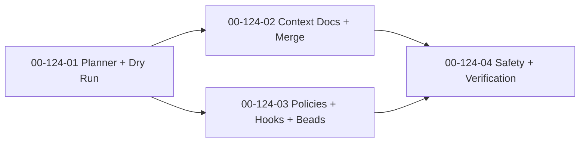

# SDP Bootstrap — Implementation Plan

**Date:** 2026-04-13
**Status:** Proposed
**Feature:** F124
**Design:** [2026-04-13-sdp-bootstrap-design.md](2026-04-13-sdp-bootstrap-design.md)
**Parent Plan:** [2026-04-13-sdp-toolkit-implementation-plan.md](2026-04-13-sdp-toolkit-implementation-plan.md)
**Goal:** ship `sdp bootstrap` as a brownfield-safe setup generator that turns repository analysis into agent-ready docs, guardrails, hooks, and optional issue-tracker bootstrap without hidden mutation or guessed conventions.

---

## Outcome

After `F124`, SDP should be able to make an unknown repository agent-ready in one guided pass instead of a brittle 30-minute manual setup ritual.

The feature is done when:

1. `sdp bootstrap --dry-run` and `sdp bootstrap status` explain exactly what will be generated before any file changes happen;
2. `CLAUDE.md` and `AGENTS.md` can be generated or merged without deleting user-authored content;
3. policies, hooks, and optional beads setup are generated from repository facts rather than copied templates or LLM guesses;
4. reruns are idempotent and verification output makes failures actionable;
5. bootstrap works with scout-only inputs and improves when architect, metrics, spec, and index artifacts exist.

## Workstreams

### WS-01: Bootstrap Planner and Dry-Run

**Workstream:** [00-124-01](../workstreams/backlog/00-124-01.md)
**Beads:** `sdplab-25nr`

**Why:** bootstrap is unsafe if it writes first and explains later.

**Changes:**

- collect available toolkit inputs from `.sdp/` and detect what is missing;
- detect pre-existing `CLAUDE.md`, `AGENTS.md`, hooks, `.sdp/`, and `.beads/` surfaces;
- define the bootstrap plan and report contracts;
- implement `sdp bootstrap --dry-run` and `sdp bootstrap status`;
- make missing enrichments degrade into explicit defaults instead of opaque failure.

**Acceptance:**

- dry-run shows creates, merges, skips, and verification intent before mutation;
- status explains current bootstrap state and missing prerequisites;
- bootstrap can collect scout-only inputs and gracefully tolerate absent metrics/index/spec/architect artifacts;
- no file writes happen before the plan phase completes;
- the plan surface is trustworthy enough to use on brownfield repositories.

### WS-02: Context Docs Generation and Merge Strategy

**Workstream:** [00-124-02](../workstreams/backlog/00-124-02.md)
**Beads:** `sdplab-lbdn`

**Why:** the primary user-visible artifact is still `CLAUDE.md`. If merge behavior is sloppy, the whole bootstrap feature becomes scary.

**Changes:**

- generate fresh `CLAUDE.md` and `AGENTS.md` from analysis-backed templates;
- implement explicit merge markers for generated sections;
- preserve existing user-authored sections and never silently delete them;
- keep output concise, specific, and data-backed;
- allow scout-only generation while enriching output when adjacent artifacts exist.

**Acceptance:**

- new repos get usable context docs in one pass;
- existing repos keep user-authored content during merge mode;
- generated sections are clearly marked for later safe updates;
- output quality improves with architect, metrics, spec, and index data but does not require them;
- tests cover fresh generation and brownfield merge scenarios.

### WS-03: Policies, Hooks, and Beads Initialization

**Workstream:** [00-124-03](../workstreams/backlog/00-124-03.md)
**Beads:** `sdplab-dpa0`

**Why:** bootstrap is not complete if it only writes docs and leaves operational guardrails manual.

**Changes:**

- generate `.sdp/policies/` from sensitive-path and repo-risk signals;
- generate hook templates from detected build, test, lint, and commit conventions;
- validate generated hook syntax;
- make beads initialization and import explicit opt-in behavior;
- emit a bootstrap report that records what was generated, skipped, or left unverified.

**Acceptance:**

- generated policies and hooks reflect repo facts rather than generic boilerplate;
- hooks pass syntax validation before being offered as done;
- beads setup is never a hidden side effect;
- bootstrap report is stable enough for later tooling and review;
- useful output still exists when scout is the only input.

### WS-04: Brownfield Safety and Verification Gates

**Workstream:** [00-124-04](../workstreams/backlog/00-124-04.md)
**Beads:** `sdplab-3p4x`

**Why:** this workstream decides whether bootstrap is adoptable or whether operators will avoid it after one bad overwrite.

**Changes:**

- enforce idempotent reruns for unchanged inputs;
- implement explicit `--force`, `--only`, and verification controls;
- run and report build/test/lint verification where commands were detected;
- make failure output include rollback or recovery guidance;
- align final brownfield behavior with richer neighboring artifacts when metrics and index outputs are available.

**Acceptance:**

- rerunning bootstrap does not create noisy drift on unchanged repos;
- selective generation and override paths are explicit and tested;
- verification results are understandable and actionable, not just exit codes;
- brownfield repos with existing docs, hooks, and policies remain safe;
- the final feature is adoptable without requiring users to trust silent mutation.

## Execution Order

This order is deliberate:

- the plan surface comes first, because bootstrap without preview is bad UX;
- docs and operational artifacts can split after planning;
- safety and verification come last, because they must validate the real generated surfaces rather than placeholders.

## Delivery Slices

### Slice A: Safe Planning Surface

- `00-124-01`

**Visible result:** operators can see exactly what bootstrap intends to do before anything changes.

### Slice B: Agent Context Docs

- `00-124-02`

**Visible result:** `CLAUDE.md` and `AGENTS.md` become reproducible, data-backed, and merge-safe.

### Slice C: Operational Guardrails

- `00-124-03`

**Visible result:** policies, hooks, and optional beads bootstrap turn context into working repo conventions.

### Slice D: Adoption Safety

- `00-124-04`

**Visible result:** bootstrap becomes rerunnable and trustworthy on brownfield repositories.

## Explicit Stop Conditions

Stop and revisit the design if any of these happen:

1. bootstrap starts overwriting user-authored files by default instead of planning or merging;
2. generated docs become verbose filler rather than repo-specific working context;
3. policies or hooks are emitted from guessed defaults that contradict detected repo conventions;
4. verification is reported as success without actually running the detected commands;
5. optional enrichments become hard requirements and scout-only bootstrap stops being useful.

## Recommended Commit Sequence

1. `plan(bootstrap): implementation slices for brownfield-safe setup generation`
2. `feat(bootstrap): planner and dry-run surfaces`
3. `feat(bootstrap): context docs generation and merge`
4. `feat(bootstrap): policies hooks and bootstrap report`
5. `feat(bootstrap): safety gates and verification flow`
