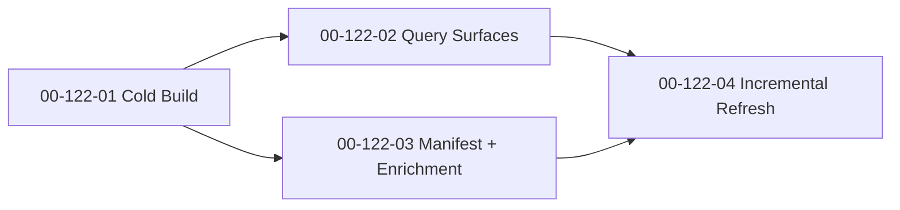

# SDP Index — Implementation Plan

**Date:** 2026-04-13
**Status:** Proposed
**Feature:** F122
**Design:** [2026-04-13-sdp-index-design.md](2026-04-13-sdp-index-design.md)
**Parent Plan:** [2026-04-13-sdp-toolkit-implementation-plan.md](2026-04-13-sdp-toolkit-implementation-plan.md)
**Goal:** ship `sdp index` as a local repository-memory system that gives agents a fast context primer, stable query surfaces, and incremental refresh without introducing a required external service.

---

## Outcome

After `F122`, SDP should be able to replace repeated repo rescans with one durable local memory layer:

1. cold-build a repository index into `.sdp/index.db`;
2. answer semantic, structural, and navigational questions from that index;
3. generate `.sdp/manifest.md` as always-on context;
4. enrich index metadata from neighboring toolkit artifacts when available;
5. refresh incrementally instead of rebuilding everything on each session.

The feature is done when the repository-level MVP from the design works end to end. Multi-repo and organization indexing remain future scope.

## Workstreams

### WS-01: Index Store, Chunking, and Cold Build

**Workstream:** [00-122-01](../workstreams/backlog/00-122-01.md)
**Beads:** `sdplab-hxiu`

**Why:** query UX, manifest generation, and incremental refresh are meaningless until the cold-build substrate is correct and stable.

**Changes:**

- implement the SQLite schema for chunks, vectors, FTS, edges, files, modules, and metadata;
- implement tree-sitter based chunking and structural edge extraction;
- define the file and chunk hashing model for later incremental refresh;
- implement repository-level `sdp index build`;
- enforce exclusions for secrets, binaries, generated files, and oversized files.

**Acceptance:**

- cold build materializes `.sdp/index.db` with the schema from the design;
- supported languages produce chunks and edges with stable metadata;
- the system works without a permanently running embedding or database service;
- cold-build tests prove correctness on fixture repos;
- repository-level MVP is shippable before any Level 2 or Level 3 work starts.

### WS-02: Query Surfaces — semantic, structural, navigational

**Workstream:** [00-122-02](../workstreams/backlog/00-122-02.md)
**Beads:** `sdplab-bi7k`

**Why:** an index that only stores data is an implementation detail. The product surface is the query behavior.

**Changes:**

- implement semantic query flow with hybrid retrieval and deterministic fallback behavior;
- implement dependency traversal for forward and reverse structural lookups;
- implement navigational lookup for identifiers, paths, and literals;
- add PageRank or structural importance signals where the design calls for them;
- lock stable response contracts for CLI, skills, and MCP consumers.

**Acceptance:**

- `sdp index query`, `sdp index deps`, and `sdp index find` are each useful on their own;
- semantic lookup still degrades gracefully when embeddings are unavailable;
- structural queries return graph answers at a useful abstraction level;
- exact lookup remains fast and predictable;
- tests cover FTS, structural traversal, and fused-ranking behavior.

### WS-03: Manifest and Enrichment Pipeline

**Workstream:** [00-122-03](../workstreams/backlog/00-122-03.md)
**Beads:** `sdplab-sstz`

**Why:** the index only changes agent UX once its output becomes consumable as lightweight context and not just as a database file.

**Changes:**

- generate `.sdp/manifest.md` from indexed repository state;
- ingest scout, metrics, architect, and spec outputs when they exist;
- enrich modules and files with owner, hotspot, bus-factor, and purpose data;
- keep enrichment optional so missing neighbors never block index usage.

**Acceptance:**

- manifest stays concise enough for default agent context;
- enrichment improves quality but never becomes a hidden hard dependency;
- missing artifacts degrade cleanly;
- tests cover manifest generation and partial-enrichment scenarios;
- the result is good enough to support `@understand` and `bootstrap`.

### WS-04: Incremental Refresh, Hooks, and Performance

**Workstream:** [00-122-04](../workstreams/backlog/00-122-04.md)
**Beads:** `sdplab-760v`

**Why:** without refresh and guardrails, the index will either rot or become too expensive to keep current.

**Changes:**

- implement `sdp index refresh` based on file hashes and changed-content detection;
- define the explicit hook or watch model without making background mode mandatory;
- test large-repo and partial-update performance expectations;
- carry exclusion and safety rules into refresh flows as well;
- document repository-only scope so future multi-repo ambitions do not leak into the MVP.

**Acceptance:**

- refresh updates only changed content and metadata;
- manual refresh remains first-class, even if watch mode exists;
- performance budgets are explicit and tested;
- refresh never widens the set of indexed sensitive files;
- incremental correctness is proven by tests on modified fixture repos.

## Execution Order

This order is intentional:

- cold build first, because every later surface depends on stable indexed truth;
- query and manifest can split after that;
- incremental refresh comes last, because it must preserve the semantics of both storage and outputs.

## Delivery Slices

### Slice A: Durable Substrate

- `00-122-01`

**Visible result:** repository-level `.sdp/index.db` exists and can be rebuilt from source.

### Slice B: Queryable Memory

- `00-122-02`

**Visible result:** agents and operators can ask the index useful questions instead of rescanning the repo.

### Slice C: Context Surface

- `00-122-03`

**Visible result:** `.sdp/manifest.md` and enriched metadata make the index usable in normal workflows.

### Slice D: Sustainable Operation

- `00-122-04`

**Visible result:** index upkeep is fast enough and safe enough for repeated daily use.

## Explicit Stop Conditions

Stop and revisit the design if any of these happen:

1. Level 1 repository indexing starts absorbing Level 2 or Level 3 scope;
2. embeddings become a mandatory dependency instead of an optional quality layer;
3. semantic search quality depends on undocumented ranking heuristics that cannot be tested;
4. manifest generation grows beyond "always-in-context" size and becomes another bloated report;
5. refresh correctness is weaker than cold-build correctness.

## Recommended Commit Sequence

1. `plan(index): implementation slices for repository memory`
2. `feat(index): store schema and cold build pipeline`
3. `feat(index): query surfaces and ranking`
4. `feat(index): manifest and enrichment pipeline`
5. `feat(index): incremental refresh and performance guards`
