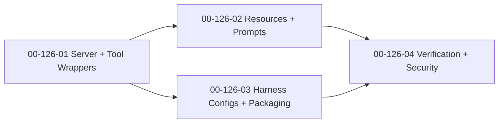

# SDP MCP — Implementation Plan

**Date:** 2026-04-13
**Status:** Proposed
**Feature:** F126
**Design:** [2026-04-13-sdp-mcp-design.md](2026-04-13-sdp-mcp-design.md)
**Parent Plan:** [2026-04-13-sdp-toolkit-implementation-plan.md](2026-04-13-sdp-toolkit-implementation-plan.md)
**Goal:** ship `sdp-mcp` as one stdio MCP server that exposes toolkit tools, `.sdp/` resources, and intent prompts across supported harnesses without duplicating CLI business logic or pretending unverified compatibility.

---

## Outcome

After `F126`, SDP should stop paying the N×M integration tax for every harness and every tool.

The feature is done when:

1. `sdp-mcp` starts as a local stdio MCP server with a stable registration surface;
2. toolkit actions are available as MCP tools by wrapping the existing CLI contracts rather than re-implementing them;
3. `.sdp/` artifacts and the five intent prompts are exposed through MCP resources and prompts;
4. supported harnesses have usable reference configs and installation guidance;
5. cross-harness behavior, security boundaries, and performance claims are verified instead of implied.

## Workstreams

### WS-01: MCP Server Skeleton and Tool Wrappers

**Workstream:** [00-126-01](../workstreams/backlog/00-126-01.md)
**Beads:** `sdplab-dpl9`

**Why:** the server is only valuable if tool behavior stays aligned with the CLI truth instead of drifting into a second implementation.

**Changes:**

- implement `sdp-mcp` entrypoint and stdio server lifecycle;
- register toolkit tools for scout, architect, metrics, spec, index, bootstrap, and workflow surfaces;
- wrap the existing CLI contracts for tool execution and error handling;
- keep large-output tools summary-first with resource pointers where appropriate;
- add baseline tests for startup, tool registration, and handler behavior.

**Acceptance:**

- `sdp-mcp` starts and serves MCP over stdio;
- core toolkit actions are callable as MCP tools;
- handlers do not fork business logic away from the CLI;
- failures return MCP-friendly, actionable output;
- basic happy-path and failure-path tests exist for server and tool handlers.

### WS-02: Resources and Intent Prompts

**Workstream:** [00-126-02](../workstreams/backlog/00-126-02.md)
**Beads:** `sdplab-vrgy`

**Why:** MCP is not just remote procedure calls. Without resources and prompts, agents still lose the context and workflow surfaces that make the toolkit coherent.

**Changes:**

- expose `.sdp/` artifacts such as scout, manifest, metrics, spec, architect, and bootstrap outputs as resources;
- implement prompt templates for `understand`, `build`, `fix`, `review`, and `operate`;
- make prompt assembly depend on available artifacts and intent arguments, not hidden heuristics;
- align prompt semantics with the `F125` intent model and not the retired flat skill list;
- cover missing-artifact and partial-artifact cases in tests.

**Acceptance:**

- agents can read available `.sdp/` state as MCP resources;
- the five intents are usable as MCP prompts with explicit parameters;
- prompts degrade gracefully when some artifacts are missing;
- prompt assembly reuses existing toolkit outputs instead of duplicating analysis logic;
- tests cover partial context and missing-resource behavior.

### WS-03: Harness Configs and Packaging

**Workstream:** [00-126-03](../workstreams/backlog/00-126-03.md)
**Beads:** `sdplab-y2vd`

**Why:** a server that exists only for people willing to reverse-engineer setup is not shipped.

**Changes:**

- provide reference configs for the supported harnesses named in the design;
- document installation and local path expectations for each harness;
- align config examples with the actual server names, tools, resources, and prompts;
- keep packaging focused on one local binary and explicit repo path assumptions;
- avoid implying support for clients that are not in the tested matrix.

**Acceptance:**

- each supported harness has a concrete config example;
- installation docs are enough to enable `sdp-mcp` without bespoke tribal knowledge;
- config examples match real server behavior;
- local-binary expectations are explicit;
- packaging docs do not promise more than the test matrix covers.

### WS-04: Cross-Harness Verification and Security Hardening

**Workstream:** [00-126-04](../workstreams/backlog/00-126-04.md)
**Beads:** `sdplab-g9yf`

**Why:** MCP support without verification is marketing, and protocol glue is an easy place to accidentally widen local permissions.

**Changes:**

- build the end-to-end verification matrix for supported harnesses;
- test consistency of tool, resource, and prompt behavior across that matrix;
- lock permission boundaries, path handling, and expected local-process access rules;
- define performance budgets for startup, tool overhead, resource reads, and prompt renders;
- document what the MCP layer can and cannot access.

**Acceptance:**

- supported harnesses are verified against one explicit matrix;
- server behavior is consistent enough across harnesses to claim support honestly;
- security notes and tests make local permission boundaries explicit;
- performance expectations are measured and documented;
- the final MCP surface is safe enough to recommend for real daily use.

## Execution Order

This order is intentional:

- server and tool wrappers first, because everything else depends on a stable MCP core;
- resources/prompts and packaging can split after the core exists;
- verification and hardening come last, because they must validate the real exposed surface rather than a design promise.

## Delivery Slices

### Slice A: Universal Tool Surface

- `00-126-01`

**Visible result:** toolkit commands become callable from any MCP-capable harness through one server.

### Slice B: Context and Intent Layer

- `00-126-02`

**Visible result:** agents can read repo state and invoke intent prompts through MCP, not just raw tools.

### Slice C: Installation Surface

- `00-126-03`

**Visible result:** supported harnesses can actually enable the server without bespoke setup work.

### Slice D: Honest Support Boundary

- `00-126-04`

**Visible result:** support claims, performance, and security boundaries are backed by a test matrix instead of assumption.

## Explicit Stop Conditions

Stop and revisit the design if any of these happen:

1. tool handlers start re-implementing toolkit business logic instead of wrapping the CLI contracts;
2. resource or prompt behavior silently depends on artifacts that are not present or not documented;
3. harness configs claim compatibility for clients that are not in the verified matrix;
4. the MCP layer widens filesystem or process access beyond the underlying local CLI model without explicit review;
5. support claims are based on docs alone rather than cross-harness verification evidence.

## Recommended Commit Sequence

1. `plan(mcp): implementation slices for universal toolkit interface`
2. `feat(mcp): stdio server and cli tool wrappers`
3. `feat(mcp): resources and intent prompts`
4. `feat(mcp): harness configs and packaging docs`
5. `feat(mcp): verification matrix and security hardening`
