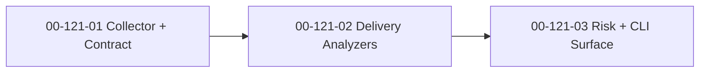

# SDP Metrics — Implementation Plan

**Date:** 2026-04-13
**Status:** Proposed
**Feature:** F121
**Design:** [2026-04-13-sdp-metrics-design.md](2026-04-13-sdp-metrics-design.md)
**Parent Plan:** [2026-04-13-sdp-toolkit-implementation-plan.md](2026-04-13-sdp-toolkit-implementation-plan.md)
**Goal:** ship `sdp metrics` as a deterministic, git-only health surface with a stable JSON contract first and human-facing renderers second.

---

## Outcome

After `F121`, SDP should be able to answer "how healthy is this repo's delivery process?" without any LLM dependency.

The feature is done when:

1. one collector pass produces the raw git dataset;
2. all seven categories are computed from that shared dataset;
3. `MetricsReport` is stable enough for downstream consumers;
4. CLI output works for both machine and human consumption;
5. later layers such as `@understand`, `bootstrap`, and `index` can consume the report without re-implementing metrics logic.

## Workstreams

### WS-01: Git Ingestion Pipeline and Metrics Contract

**Workstream:** [00-121-01](../workstreams/backlog/00-121-01.md)
**Beads:** `sdplab-sg5a`

**Why:** if every analyzer runs its own git query, the numbers drift and performance collapses on large repos.

**Changes:**

- implement the single-pass collector over `git log --numstat`;
- collect tags, remote branches, and merge history with bounded auxiliary calls;
- define `RawCommit`, `FileChange`, and `MetricsReport` contracts;
- centralize global filtering for bots, generated files, formatting-only churn, and CI-only changes;
- lock the JSON contract with fixtures or golden tests.

**Acceptance:**

- all later analyzers consume one shared raw dataset;
- the metrics contract is versioned and stable enough for JSON and markdown outputs;
- collector and filter tests cover empty repos, no-tag repos, single-author repos, and noisy bot histories;
- the implementation stays within the four git-call model from the design.

### WS-02: Delivery Hygiene Analyzers

**Workstream:** [00-121-02](../workstreams/backlog/00-121-02.md)
**Beads:** `sdplab-aiyg`

**Why:** the first useful question is not "what is the perfect architecture," but "does this team deliver cleanly or chaotically?"

**Changes:**

- implement commit hygiene metrics;
- implement wasted-work metrics;
- implement git-flow detection;
- implement release-quality metrics;
- keep thresholds and final traffic-light interpretation separate from raw analyzer output.

**Acceptance:**

- hygiene reports ticket linkage, conventional-commit behavior, and fix-to-feature balance;
- waste reports churn, abandoned branches, and revert rate;
- git-flow detection returns model, confidence, and evidence;
- release quality reports post-release fix windows and time-to-first-hotfix;
- synthetic-history tests prove the analyzers match expected patterns.

### WS-03: Knowledge, Decay, and CLI Consumption

**Workstream:** [00-121-03](../workstreams/backlog/00-121-03.md)
**Beads:** `sdplab-kxg8`

**Why:** a metrics engine without a final consumable surface is still an internal library, not a product tool.

**Changes:**

- implement release stabilization analysis;
- implement knowledge-risk analysis;
- implement code-decay analysis;
- add traffic-light thresholds and stable text/markdown output;
- ship `sdp metrics` CLI flags for format, period, category filters, output path, and timing.

**Acceptance:**

- all seven categories are present in the final `MetricsReport`;
- JSON remains the source of truth and markdown/text are derived views;
- CLI output is useful without architect or LLM context;
- output is rich enough for later `@understand` and index enrichment;
- analyzer and CLI tests prove stable behavior across fixture repos.

## Execution Order

The order is intentionally strict. `WS-02` and `WS-03` should not fork around `WS-01`, because the collector and report contract are the only shared truth.

## Delivery Slices

### Slice A: Deterministic Substrate

- `00-121-01`

**Visible result:** `sdp metrics` has a stable raw-data path and a report contract that later work can trust.

### Slice B: Delivery Behavior

- `00-121-02`

**Visible result:** operators can see whether a repo has clean commit discipline, high churn, unstable flow, or release pain.

### Slice C: Risk Surface and UX

- `00-121-03`

**Visible result:** the metrics feature becomes consumable by humans, intents, and later toolkit layers.

## Explicit Stop Conditions

Stop and revisit the design if any of these happen:

1. the implementation requires per-analyzer rescans instead of the shared collector;
2. filters diverge from shared exclusion rules and metrics disagree with scout/index on repo shape;
3. JSON contract changes are not versioned or not covered by fixtures;
4. markdown or skill output starts embedding business logic that belongs in Go analyzers;
5. `sdp metrics` is only useful when architect or an LLM is also present.

## Recommended Commit Sequence

1. `plan(metrics): implementation slices for git-derived health analysis`
2. `feat(metrics): collector and report contract`
3. `feat(metrics): delivery hygiene analyzers`
4. `feat(metrics): knowledge and decay analyzers`
5. `feat(metrics): cli renderers and output surfaces`
