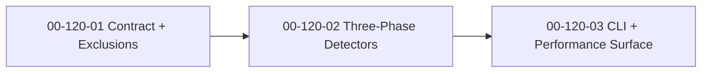

# SDP Scout — Implementation Plan

**Date:** 2026-04-13
**Status:** Proposed
**Feature:** F120
**Design:** [2026-04-13-sdp-scout-design.md](2026-04-13-sdp-scout-design.md)
**Parent Plan:** [2026-04-13-sdp-toolkit-implementation-plan.md](2026-04-13-sdp-toolkit-implementation-plan.md)
**Goal:** ship `sdp scout` as the first-touch brownfield surface: a fast, deterministic repo card that answers "what is this codebase?" without LLM cost or deep analysis latency.

---

## Outcome

After `F120`, SDP should be able to produce a trustworthy project card for an unknown repository in seconds, not minutes.

The feature is done when:

1. `sdp scout` emits a stable `ProjectCard` contract;
2. identity, scale, activity, and maturity signals are derived without LLM calls;
3. shared exclusion rules are aligned with neighboring toolkit features;
4. CLI output works for JSON, text, and compact card modes;
5. later layers such as metrics, index, and bootstrap can consume scout output without re-implementing reconnaissance.

## Workstreams

### WS-01: Project Card Contract + Shared Exclusions

**Workstream:** [00-120-01](../workstreams/backlog/00-120-01.md)
**Beads:** `sdplab-of55`

**Why:** if scout's contract and exclusions are fuzzy, every downstream tool starts from conflicting assumptions about the same repo.

**Changes:**

- define the `ProjectCard` contract and its identity, scale, activity, maturity, build, and health sections;
- centralize exclusion rules shared by scout, metrics, and index;
- lock the JSON shape for `.sdp/scout.json`;
- make unknown data explicit instead of guessed.

**Acceptance:**

- `ProjectCard` is stable enough for downstream toolkit consumers;
- exclusion rules live in one shared implementation surface;
- JSON fixtures or golden tests lock the contract;
- no network or LLM dependency is introduced;
- the feature establishes one canonical first-look surface for the toolkit lane.

### WS-02: Identity, Scale, and Activity Detectors

**Workstream:** [00-120-02](../workstreams/backlog/00-120-02.md)
**Beads:** `sdplab-uekb`

**Why:** scout is only valuable if it actually answers the first-touch operator questions fast: what stack is this, how big is it, and is it alive?

**Changes:**

- implement Phase 1 identity detection over filesystem signals;
- implement Phase 2 scale analysis including LOC, file classes, and entry-point detection;
- implement Phase 3 activity and health heuristics over git history;
- keep the phases independently testable and bounded by explicit time budgets.

**Acceptance:**

- scout detects language mix, build system, README summary, and likely entry points;
- scale analysis handles tests, generated files, vendor noise, and large-file limits correctly;
- activity analysis derives commit, contributor, branch, tag, and staleness signals from git;
- fixture-repo tests cover the major language and repo-shape cases from the design;
- integration output on `sdp_lab` is reasonable without hand-tuning.

### WS-03: CLI Surfaces, Artifacts, and Performance Harness

**Workstream:** [00-120-03](../workstreams/backlog/00-120-03.md)
**Beads:** `sdplab-eva1`

**Why:** scout is a UX feature. If the command shape, output modes, or performance are weak, the whole point of the feature collapses.

**Changes:**

- ship `sdp scout` output modes for JSON, text, and card;
- support optional `.sdp/scout.json` artifact writing;
- enforce large-repo safeguards and performance targets;
- make failure output readable when git data or repo paths are missing.

**Acceptance:**

- the CLI is useful both for humans and for downstream tooling;
- output modes stay aligned to the same source contract;
- performance stays within the fast-first-look budget from the design;
- command errors are explanatory rather than opaque;
- scout is shippable as the first visible toolkit command.

## Execution Order

This order is strict on purpose:

- contract first, because downstream tools depend on it;
- detection second, because CLI polish without working heuristics is fake progress;
- CLI and performance last, because they must prove the final user promise against the real implementation.

## Delivery Slices

### Slice A: Shared First-Look Truth

- `00-120-01`

**Visible result:** scout has a stable contract and a shared repo-boundary model.

### Slice B: Reconnaissance Engine

- `00-120-02`

**Visible result:** SDP can answer the first-touch repo questions from filesystem and git data alone.

### Slice C: Operator Surface

- `00-120-03`

**Visible result:** `sdp scout` becomes a real command, not just an internal package.

## Explicit Stop Conditions

Stop and revisit the design if any of these happen:

1. scout loses the "fast first look" UX and starts behaving like a shallow `architect`;
2. exclusions diverge from metrics or index and repo counts stop matching across tools;
3. scout starts guessing semantic meaning that belongs in architect or spec recovery;
4. JSON, text, and card outputs diverge into separate contracts;
5. large-repo safeguards are undocumented or only work by silent degradation.

## Recommended Commit Sequence

1. `plan(scout): implementation slices for quick reconnaissance`
2. `feat(scout): project card contract and shared exclusions`
3. `feat(scout): identity scale and activity detectors`
4. `feat(scout): cli outputs artifact writing and performance guards`
