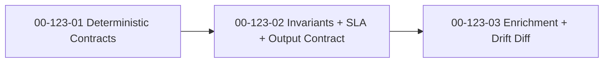

# SDP Spec Recovery — Implementation Plan

**Date:** 2026-04-13
**Status:** Proposed
**Feature:** F123
**Design:** [2026-04-13-sdp-spec-design.md](2026-04-13-sdp-spec-design.md)
**Parent Plan:** [2026-04-13-sdp-toolkit-implementation-plan.md](2026-04-13-sdp-toolkit-implementation-plan.md)
**Goal:** ship `sdp spec` as a code-driven specification recovery tool with deterministic extraction first, a stable `.sdp/specs/` contract second, and LLM enrichment only as an explicit optional layer.

---

## Outcome

After `F123`, SDP should be able to answer "what does this system actually enforce?" from repository code and config, not from stale prose.

The feature is done when:

1. deterministic extraction recovers useful API contracts and business rules without any LLM dependency;
2. invariants and SLA signals are added into one stable spec surface under `.sdp/specs/`;
3. the output contract is deterministic enough for later diffing, enrichment, and index consumption;
4. `sdp spec` works for machine-readable and human-readable output modes;
5. optional enrichment improves coverage without becoming a hidden requirement.

## Workstreams

### WS-01: Deterministic Contract Extraction

**Workstream:** [00-123-01](../workstreams/backlog/00-123-01.md)
**Beads:** `sdplab-gbk4`

**Why:** spec recovery fails as a product if the first useful result only exists behind an LLM call.

**Changes:**

- implement deterministic extraction for API contracts and business rules;
- cover the Go routing and validation patterns named in the design;
- parse OpenAPI, proto, SQL, and config inputs where they provide contract truth;
- keep the default path offline, bounded, and safe on sensitive repositories;
- define the first useful `.sdp/specs/` artifact layout.

**Acceptance:**

- extracted contracts and rules are based on code and config evidence, not narrative guesses;
- default execution requires no network or LLM runtime;
- supported Go frameworks from the design are covered by tests;
- `.sdp/specs/` output is already useful before any enrichment layer exists;
- fixture repos prove deterministic contract recovery on repeated runs.

### WS-02: Invariants, SLA Signals, and Spec Output Contract

**Workstream:** [00-123-02](../workstreams/backlog/00-123-02.md)
**Beads:** `sdplab-omd1`

**Why:** routes and rules alone are not the whole specification. The operational and database constraints are what usually bite people in production.

**Changes:**

- add invariant extraction from SQL, type, concurrency, and boundary patterns;
- add SLA signal extraction for timeouts, retries, rate limits, and resource limits;
- finalize a stable `.sdp/specs/` output contract for downstream diffing and enrichment;
- redact or skip secret literals and sensitive config values;
- keep deterministic behavior on the same input repository.

**Acceptance:**

- invariants and SLA parameters are visible in the same spec surface as contracts and rules;
- output structure is versioned and stable enough for later consumers;
- secret handling is explicit and tested;
- repeated runs on the same repo produce stable output;
- the command remains useful without any enrichment or skill layer.

### WS-03: Optional LLM Enrichment and Drift Diff

**Workstream:** [00-123-03](../workstreams/backlog/00-123-03.md)
**Beads:** `sdplab-5e10`

**Why:** enrichment is valuable for UX, but only after deterministic truth exists and diff semantics are trustworthy.

**Changes:**

- add explicit opt-in enrichment for richer rule descriptions and gap analysis;
- implement snapshot diffing for recovered specs;
- surface confidence and limits in enrichment output instead of hiding uncertainty;
- keep deterministic extraction as the baseline and fallback;
- test false-positive guardrails for enrichment and drift detection.

**Acceptance:**

- `sdp spec --enrich` is optional, never implicit;
- `sdp spec --diff` produces stable, reviewable contract drift output;
- enrichment clearly marks inferred content vs extracted facts;
- spec recovery remains useful when no LLM runtime is configured;
- tests prove stable diff semantics and bounded false positives.

## Execution Order

This sequence is strict for the MVP:

- deterministic extraction first, because no later layer can fix a weak evidence base;
- output contract second, because diffing and downstream consumption depend on stable structure;
- enrichment last, because optional UX help should sit on top of proven deterministic truth.

## Delivery Slices

### Slice A: Deterministic Truth

- `00-123-01`

**Visible result:** `sdp spec` can already recover enforceable contracts and rules from code without an LLM.

### Slice B: Operational Specification

- `00-123-02`

**Visible result:** specs include invariants and operational constraints, not just endpoint shape.

### Slice C: Insight and Drift

- `00-123-03`

**Visible result:** operators can enrich recovered specs and compare snapshots without making enrichment mandatory.

## Explicit Stop Conditions

Stop and revisit the design if any of these happen:

1. deterministic extraction starts depending on LLM interpretation for baseline usefulness;
2. `.sdp/specs/` output is not versioned or changes shape without fixture coverage;
3. enrichment becomes the default path instead of an explicit opt-in layer;
4. drift output is too noisy to review or cannot distinguish extracted facts from inferred text;
5. secret literals or sensitive config leak into persisted spec artifacts.

## Recommended Commit Sequence

1. `plan(spec): implementation slices for code-driven spec recovery`
2. `feat(spec): deterministic contract and rule extraction`
3. `feat(spec): invariants sla and output contract`
4. `feat(spec): opt-in enrichment and drift diff`
