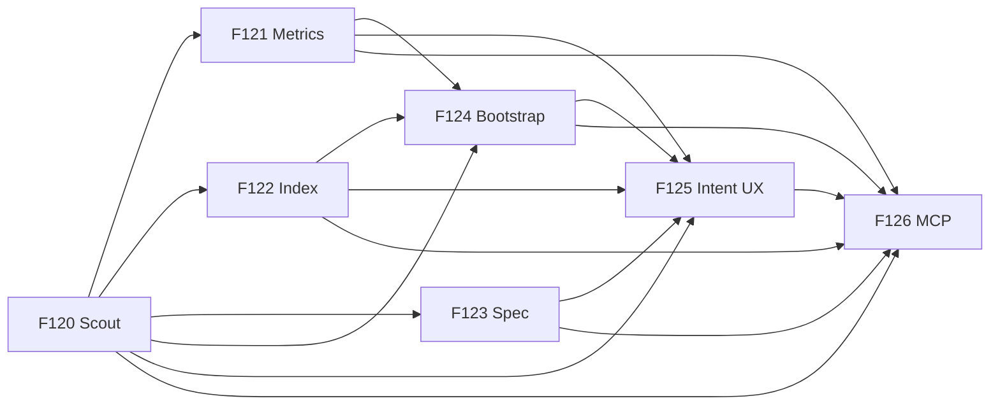

# SDP Toolkit Implementation Plan

**Date:** 2026-04-13
**Status:** Proposed
**Vision:** [2026-04-13-sdp-toolkit-vision-design.md](2026-04-13-sdp-toolkit-vision-design.md)
**Goal:** turn the toolkit vision into an executable backlog with feature IDs, workstreams, Beads issues, and roadmap placement.

---

## Planning Decisions

1. **Do not duplicate `@architect`.** `sdp architect` is treated as an existing dependency surface. This lane consumes its outputs and does not re-split `F105` into a second architect backlog.
2. **Do not plan dead concepts.** `@landscape` and `@plan` are not separate features. They are absorbed by `F125` as `@understand` depth routing and `@operate --mode plan`.
3. **Do not publish unstable contracts too early.** This lane stabilizes local `.sdp/` contracts first. Public schema publication to `sdp/` is deferred until the shapes stop moving.
4. **Do not invent `activate`.** The vision names an activation stage, but there is no accepted design for it yet. This plan stops at toolkit surfaces, bootstrap, intent UX, and MCP.

## Outcome

After `F120`..`F126`, SDP should support one coherent path from an unknown brownfield repo to an agent-ready workspace:

1. get a fast repo card;
2. measure process health;
3. build persistent memory;
4. recover implicit contracts;
5. generate safe bootstrap artifacts;
6. expose the workflow through five user-facing intents;
7. expose the same capability set through MCP.

## Feature Sequence

| Feature | Priority | Outcome | Depends On | Beads |
|---|---|---|---|---|
| `F120` Toolkit Scout | P1 | 30-second project card with stable `scout.json` and shared exclusions | - | `sdplab-7uke` |
| `F121` Toolkit Metrics | P1 | git-only health report for hygiene, flow, risk, and decay | `F120` | `sdplab-rswa` |
| `F122` Toolkit Index | P1 | persistent `.sdp/index.db` + `.sdp/manifest.md` for agent memory | `F120` | `sdplab-8v75` |
| `F123` Toolkit Spec Recovery | P2 | recovered contracts, rules, invariants, and SLA signals in `.sdp/specs/` | `F120` | `sdplab-uoht` |
| `F124` Toolkit Bootstrap | P1 | brownfield-safe setup for context docs, policies, hooks, and beads | `F120`, `F121`, `F122` | `sdplab-yeqt` |
| `F125` Toolkit UX | P1 | five intent-based skills over composable toolkit tools | `F120`, `F121`, `F122`, `F123`, `F124` | `sdplab-pr3h` |
| `F126` Toolkit MCP | P2 | one MCP server exposing toolkit tools, resources, and prompts | `F120`..`F125` | `sdplab-efmf` |

## Release Slices

### Slice A: First Look

- `F120` Toolkit Scout
- `F121` Toolkit Metrics

**User-visible result:** an operator can point SDP at an unknown repo and get a fast, deterministic answer about what it is and how healthy it looks.

### Slice B: Persistent Context

- `F122` Toolkit Index
- `F123` Toolkit Spec Recovery

**User-visible result:** agents stop re-scanning the repo from scratch and can answer structural and contract questions from local artifacts.

### Slice C: Agent-Ready Setup

- `F124` Toolkit Bootstrap
- `F125` Toolkit UX

**User-visible result:** brownfield adoption becomes a guided, low-risk setup flow with a smaller skill surface and explicit intent routing.

### Slice D: Universal Interface

- `F126` Toolkit MCP

**User-visible result:** the same toolkit works from Claude Code, Cursor, VS Code, Codex, and OpenCode through one MCP surface.

## Execution Order

## Stop Conditions

Stop and re-open the design if any of these happen:

1. `sdp scout` requires LLM calls or loses the sub-30-second UX target.
2. `metrics`, `index`, and `scout` drift onto different exclusion rules and disagree on what the repo contains.
3. `bootstrap` mutates files before showing a dry-run/merge plan.
4. intent routing hides the underlying tool calls and creates a second source of truth.
5. MCP ships before local CLI contracts are stable enough to freeze.

## Canonical Workstream Backlog

Feature-level planning lives here. Executable scope lives in:

- `docs/workstreams/backlog/00-120-01.md` ... `00-120-03.md`
- `docs/workstreams/backlog/00-121-01.md` ... `00-121-03.md`
- `docs/workstreams/backlog/00-122-01.md` ... `00-122-04.md`
- `docs/workstreams/backlog/00-123-01.md` ... `00-123-03.md`
- `docs/workstreams/backlog/00-124-01.md` ... `00-124-04.md`
- `docs/workstreams/backlog/00-125-01.md` ... `00-125-04.md`
- `docs/workstreams/backlog/00-126-01.md` ... `00-126-04.md`
