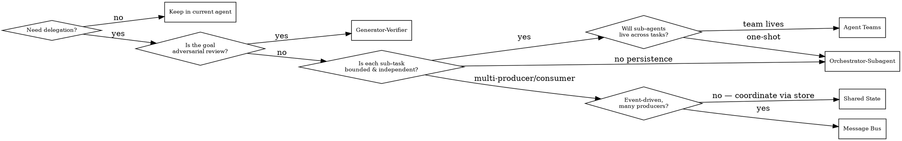

# Multi-Agent Orchestration Patterns — SDP Playbook

> **Scope:** когда и как SDP-агенты делегируют работу друг другу.
> **Source:** адаптация [Anthropic — Multi-agent coordination patterns](https://claude.com/blog/multi-agent-coordination-patterns) (апрель 2026) к SDP FSM.
> **Policy:** F127-04 (`docs/plans/2026-04-16-f127-multi-harness-modernization-design.md`).

## Why patterns

SDP-execution kernel (`internal/agentloop` FSM) уже смешивает несколько моделей координации — но без явного выбора. Разные фазы (Discover, Plan, Build, Review, Eval) требуют разной семантики. Без формализации:

- орchestrator перегружается контекстом (anti-pattern Orchestrator-Bottleneck);
- параллелизм применяется там, где задачи на самом деле связаны (false speedup);
- sub-агенты получают «рекурсивную» работу, которая должна была остаться у lead'а.

Этот doc фиксирует пять паттернов Anthropic с SDP-примерами, decision tree и cost estimate.

## Decision tree

Текстовая форма:

1. **Need delegation?** Если нет — не делегируй. Делегирование стоит минимум 1000-2000 токенов context-bootstrap у sub-агента.
2. **Adversarial review?** Генератор vs. критик (e.g., implementer vs. spec-reviewer) → Generator-Verifier.
3. **Bounded & independent?** Да → Orchestrator-Subagent (если one-shot) или Agent Teams (если живой worker pool).
4. **Event-driven с многими производителями/потребителями?** → Message Bus.
5. **Multi-agent без прямой коммуникации, но через shared store?** → Shared State.

## Pattern 1 — Generator-Verifier

**Идея:** один агент генерирует артефакт (код, spec, review plan); другой агент критикует его независимо, не видя контекста генератора.

### SDP usage

| Где | Generator | Verifier |
|---|---|---|
| Delivery FSM / Build phase | `implementer` (TDD) | `spec-reviewer` (AC check) |
| Delivery FSM / Review phase | `tech-lead` (review plan) | `qa` + `security` + `sre` (multi-axis critique) |
| Discovery / council | одна модель | другая модель (blind review, llm-council skill) |

### When

- Задача бинарна (pass/fail, approve/reject).
- Generator легко «самосогласуется» с собой — нужен независимый оценщик.
- Есть чёткий критерий (spec, AC, threat model, SLO).

### Anti-patterns

- Generator и Verifier используют **одну модель с тем же контекстом** — это не adversarial, это self-review.
- Verifier получает **полный генеративный чат** — он уже не blind.
- Нет **tie-breaker** — если два раунда не сходятся, нужен Decision Owner (human).

### Cost

~2× токенов относительно single-agent; результат — 20-40% меньше defects (согласно llm-council ретро).

## Pattern 2 — Orchestrator-Subagent (one-shot)

**Идея:** lead (orchestrator) делегирует bounded-задачу sub-агенту. Sub-агент возвращает артефакт одним финальным сообщением и умирает.

### SDP usage

| Orchestrator | Subagent | Bounded task |
|---|---|---|
| `orchestrator` | `scout` | «Скан репо, верни scout.json» |
| `planner` | `analyst` | «Декомпозируй feature в 3-5 workstream» |
| `reviewer` | `security` | «Threat model на этот PR» |
| sdp-harness FSM | `implementer` | «Реализуй WS 00-FFF-SS, верни diff + evidence» |

### When

- Задача **bounded** — ясный вход, ясный выход, без открытых циклов.
- Sub-агент **не нуждается** в состоянии после возврата.
- Отсутствует **shared state** с другими sub-агентами.
- **≥3 независимых** задач → можно диспатчить параллельно (см. [Parallel dispatch](#parallel-dispatch-rules)).

### Anti-patterns

- Orchestrator-bottleneck: lead собирает все sub-outputs в свой контекст, контекст взрывается (>80K tokens).
- Sub-агент делает **рекурсивный dispatch** (Orchestrator делегирует A, A делегирует B, B делегирует C) — context tax умножается.
- Sub-агент получает **несвязанные подзадачи** в одном prompt'е — результат получается смешанный, не атомарный.

### Cost

1× на каждого sub-агента + ~500-1500 токенов context-bootstrap. При параллельном dispatch N независимых задач — ~N× sub-агентов, но wall-clock ≈ 1× longest.

## Pattern 3 — Agent Teams (persistent workers)

**Идея:** стабильный пул worker-агентов, переживающих много задач. Общая `TaskList`, `SendMessage` между ними, общий backlog.

### SDP usage (будущее)

| Team | Workers | Когда |
|---|---|---|
| «Delivery squad» | implementer, spec-reviewer, qa | Один PR живёт через несколько циклов build→review→fix |
| «Discovery squad» | scout, analyst, architect | Cold-start на brownfield repo с длинным onboarding |

Note: На апрель 2026 production SDP использует one-shot Orchestrator-Subagent. Agent Teams — roadmap (F126 + Claude Code agent teams experimental flag).

### When

- Workers нужны **re-используемыми** между задачами.
- Есть реальный **параллелизм** (≥3 concurrent задач).
- Окупается **3-4× token cost** за счёт persistence (нет повторного context-bootstrap).

### Anti-patterns

- Team для 1-2 задач — не окупается, dominate'ом становится идущий bootstrap cost.
- Нет чёткого TaskList-схема → workers берут дубли.
- Lead'а нет — workers спорят друг с другом без tie-breaker.

### Cost

3-4× token spend vs. one-shot; реальный параллелизм → wall-clock в 2-3× быстрее для pipeline'ов с ≥5 задачами.

## Pattern 4 — Message Bus

**Идея:** event-driven pub/sub. Агенты публикуют события; подписанные агенты реагируют.

### SDP usage

| Bus | Producers | Consumers |
|---|---|---|
| CI findings bus | GitHub Actions (сensor) | Local analysis agent → beads issues |
| Beads queue | any agent creating work | beads:task-agent |
| Review findings | reviewer, qa, security | orchestrator (собирает blocking findings) |

SDP already использует эту модель через beads queue + `scripts/beads_transport.sh`.

### When

- **Многие producers**, **многие consumers**; связь не 1:1.
- События **асинхронные** (findings appear когда-то позже).
- Нужна **persistence/replay** — события живут дольше, чем sub-агентские сессии.

### Anti-patterns

- Bus для 2-х агентов с 1:1 связью — over-engineering.
- Нет **ordering/causality** гарантий → race в consumer'ах.
- Нет **dead-letter** политики — stuck events заедают очередь.

### Cost

Low per-event; требует инфраструктуру (beads, git log, Dolt). SDP уже платит этот cost.

## Pattern 5 — Shared State

**Идея:** агенты не шлют друг другу сообщения; они читают/пишут общий store (файловая система, DB, ConfigMap).

### SDP usage

| Store | Писатели | Читатели |
|---|---|---|
| `.sdp/evidence/` | implementer, qa | reviewer, orchestrator, CI |
| `.sdp/checkpoints/` | orchestrate FSM | recovery on restart |
| `.sdp/dispatch/profiles/*.json` | dispatch router | future dispatch decisions |
| `.agents/skills/` | skill authors | all harness'ы |

### When

- Нет **direct messaging** — state долгоживущий, читают разные агенты в разное время.
- Нужна **крах-устойчивость** (checkpoint, replay).
- Store — **single source of truth**, не кэш.

### Anti-patterns

- Race conditions: два агента одновременно пишут в один файл без lock.
- Store становится **implicit bus** — агенты polling'уют изменения (→ тогда лучше Message Bus).
- Схема store **эволюционирует** без версионирования → старые артефакты нечитаемы.

### Cost

Low CPU/token; требует дисциплину versioning и concurrency-safe записи.

## Parallel dispatch rules

Следуют из [ClaudeFast best practices 2026](https://claudefa.st/blog/guide/agents/sub-agent-best-practices). **ВСЕ** условия должны выполняться:

1. **≥3 независимых задач** — иначе bootstrap tax съест выгоду.
2. **No shared state** — sub-агенты не пишут в одни и те же файлы.
3. **Чёткие file boundaries** — task A touches `foo.go`, task B touches `bar.go`.
4. **Clear goal per agent** — один sub-агент = один пройденный acceptance-критерий.
5. **Bounded output** — sub-агент возвращает сводку, не полный лог.

Если **любое** не выполнено → делай sequential.

### Example — parallel (good)

3 независимых skill-файла: добавить frontmatter в каждый. Dispatch 3 sub-агентам.

### Example — sequential (good)

Fix bug, затем добавить test, затем update changelog. Каждый шаг зависит от предыдущего → sequential.

### Example — parallel, but subtle fail

«Fix N тестов». Звучит независимо, но если тесты используют shared fixture, параллельный fix создаёт merge conflict. → sequential или isolated worktree per agent.

## Model tiering (cost optimization)

Anthropic (и Claude Code) поддерживают tiering через `CLAUDE_CODE_SUBAGENT_MODEL`:

| Tier | Model | Typical role |
|---|---|---|
| Opus | main orchestrator, final reviewer | complex planning, final decisions |
| Sonnet | implementer, spec-reviewer | bulk execution |
| Haiku | scout, discovery, lookups | fan-out, lightweight queries |

SDP-рекомендация: **Opus** для `orchestrator` + `architect`; **Sonnet** для `implementer` + `qa` + `reviewer`; **Haiku** для `scout` + `analyst` discovery-fan-out. Экономия 40-60% токенов относительно uniform-Opus setup.

## Choosing the right pattern for SDP phases

| SDP Phase | Primary pattern | Secondary pattern |
|---|---|---|
| Discovery | Orchestrator-Subagent | Generator-Verifier (llm-council) |
| Plan | Orchestrator-Subagent | Shared State (`.sdp/plan/`) |
| Build | Orchestrator-Subagent | Generator-Verifier (implementer ↔ spec-reviewer) |
| Review | Generator-Verifier | Message Bus (findings → beads) |
| Eval | Shared State | Message Bus (metrics → dashboards) |

## Anti-pattern catalog

| Anti-pattern | Symptom | Fix |
|---|---|---|
| Orchestrator-bottleneck | lead context >80K, lead тормозит | switch to Agent Teams или Shared State |
| Recursive dispatch | sub-agent спавнит sub-agent → 3 уровня | flatten: orchestrator делегирует всем directly |
| False parallel | 3 «независимых» sub-агентов touch same file | serialize или isolated worktrees |
| Bus-as-polling | consumers делают `ls` в loop | event trigger (hooks) или MCP subscriptions |
| Agent-teams-for-two | persistent team на 2 задачи | one-shot Orchestrator-Subagent |
| Silent Verifier | Verifier видит generator-контекст | blind review — только артефакт |

## References

- [Anthropic — Multi-agent coordination patterns](https://claude.com/blog/multi-agent-coordination-patterns)
- [ClaudeFast — Sub-agent best practices](https://claudefa.st/blog/guide/agents/sub-agent-best-practices) · [Agent Teams](https://claudefa.st/blog/guide/agents/agent-teams)
- SDP internal: [`internal/agentloop`](../../internal/agentloop/) · `docs/phases/DELIVERY.md` · `.agents/skills/llm-council.md`
- [F127 design](../plans/2026-04-16-f127-multi-harness-modernization-design.md)
