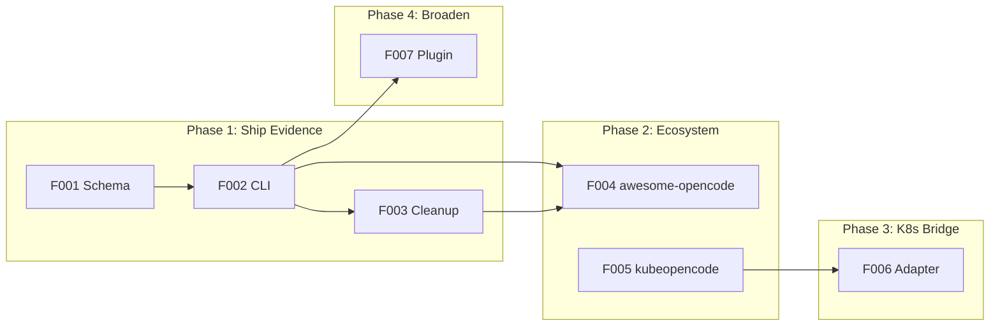

# sdp_lab Roadmap — Evidence Layer

> **Updated:** 2026-02-22
> **Direction:** From manifesto — evidence layer for OpenCode ecosystem, not a platform

---

## Overview

SDP is an evidence layer. This roadmap moves toward shipping traceforge (evidence CLI), publishing the schema, joining the ecosystem, and hardening the K8s bridge.

---

## Phase 1: Ship Evidence

**Goal:** Evidence schema published, standalone CLI released, SDP repo protocol-only.

| Feature | Workstreams | Description |
|---------|-------------|-------------|
| **F001: Evidence Schema** | 00-001-01, 00-001-02 | Formalize 9-section envelope as JSON Schema from `specs/strict-evidence-template.json` and `internal/evidence/strict.go`. Publish in sdp repo `schema/evidence-envelope.schema.json`. |
| **F002: Evidence CLI** | 00-002-01, 00-002-02, 00-002-03 | Extract `cmd/pr-gate` into standalone `cmd/sdp-evidence` with `validate` and `inspect` subcommands. Goreleaser + GitHub Actions for binary releases. Zero K8s dependency. |
| **F003: Protocol Cleanup** | — | Strip planning artifacts from sdp repo (workstreams, PRD, roadmap, beads). CLAUDE.md without M1-M4. Protocol-only. |

**Exit criteria:** `sdp-evidence validate` works as standalone binary. Schema in sdp repo. SDP repo has no workstreams/roadmap.

---

## Phase 2: Join Ecosystem

**Goal:** awesome-opencode listing, kubeopencode upstream contributions.

| Feature | Workstreams | Description |
|---------|-------------|-------------|
| **F004: awesome-opencode** | TBD | Submit protocol + evidence CLI. Write submission description. |
| **F005: kubeopencode Upstream** | TBD | Push UP-001 retry budget PR. Write UP-003 evidence hooks proposal. Contribute evidence bridge upstream. |

**Exit criteria:** Listed in awesome-opencode. At least one kubeopencode PR merged or in review.

---

## Phase 3: K8s Bridge

**Goal:** Adapter controller hardened, E2E issue→PR with evidence.

| Feature | Workstreams | Description |
|---------|-------------|-------------|
| **F006: Adapter Controller** | TBD | Harden reconcile loop. Evidence projection from CRD events. E2E flow: issue → kubeopencode Task → adapter projects evidence → PR (if valid). |

**Exit criteria:** 10 consecutive successful E2E runs. Adapter controller production-ready.

---

## Phase 4: Broaden

**Goal:** Evidence collection during local agent runs.

| Feature | Workstreams | Description |
|---------|-------------|-------------|
| **F007: OpenCode Plugin** | TBD | Thin plugin for evidence collection during local agent runs. Shells out to `sdp-evidence` binary. |

**Exit criteria:** Plugin installable via npm/opencode. Evidence emitted during local runs.

---

## Feature Index

| Feature | Status | Workstreams |
|---------|--------|-------------|
| F001 Evidence Schema | Backlog | 00-001-01, 00-001-02 |
| F002 Evidence CLI | Backlog | 00-002-01, 00-002-02, 00-002-03 |
| F003 Protocol Cleanup | Backlog | (manual) |
| F004 awesome-opencode | Planned | TBD |
| F005 kubeopencode Upstream | Planned | TBD |
| F006 Adapter Controller | Planned | TBD |
| F007 OpenCode Plugin | Planned | TBD |

---

## References

- [Manifesto](../MANIFESTO.md) — what SDP is, what exists, what's next
- [What to Keep](../plans/2026-02-22-what-to-keep.md) — CORE vs RESEARCH vs ECOSYSTEM
- [Ecosystem Identity](../plans/2026-02-22-sdp-ecosystem-identity.md) — strategy
