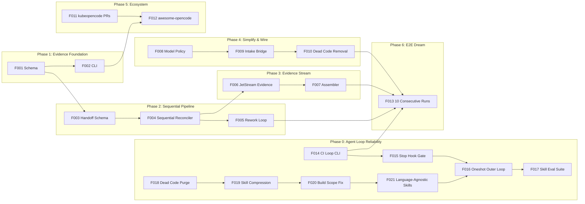

# sdp_lab Roadmap — Autonomous K8s Agent Swarm

> **Updated:** 2026-02-23
> **Direction:** Evidence layer + autonomous agent pipeline → issue in, PR with proof out
> **Design:** [Dream Swarm Design](../plans/2026-02-22-dream-swarm-design.md)
> **Research:** [Agent Loop Reliability](../plans/2026-02-23-agent-loop-reliability.md) — why LLM agents exit loops, outer loop architecture

---

## Overview

Seven phases. Phase 0 (Agent Loop Reliability) runs in parallel with everything else — it makes oneshot/review/CI loops deterministic so that Phases 1–6 execute reliably. Each phase is independently valuable.



---

## Phase 0: Agent Loop Reliability

**Goal:** LLM agents can't reliably manage their own loops (RLHF helpfulness bias, context degradation, prompt-as-suggestion). Move flow control from prompts to deterministic code. Outer loop (Go CLI / hooks) controls WHEN to stop; inner loop (LLM) controls WHAT to do.

**Research:** [Agent Loop Reliability](../plans/2026-02-23-agent-loop-reliability.md)

| Feature | Workstreams | Size | Description |
|---------|-------------|------|-------------|
| **F014: CI Loop CLI** | 00-014-01, 00-014-02 | M | `sdp ci-loop --pr N --feature FXXX`: deterministic Go process that polls `gh pr checks`, distinguishes PENDING/FAILURE/SUCCESS, rule-based classification (Go test = auto-fix, secrets = escalate), checkpoint/run file updates. Agent invokes once, waits for exit code. Works in Cursor and Claude Code. |
| **F015: Stop Hook Gate** | 00-015-01, 00-015-02 | S | Stop hook for Cursor (`.cursor/hooks.json`) and Claude Code (`.claude/settings.json`). Reads checkpoint: if `pr_number` exists and CI phase incomplete, blocks exit (exit code 2) with "run sdp ci-loop". Prevents premature handoff. |
| **F016: Oneshot Outer Loop** | 00-016-01, 00-016-02, 00-016-03, 00-016-04 | L | Replace oneshot's inline `while` loops with `sdp orchestrate` as a real outer loop. CLI drives state machine (build → review → PR → CI → done); LLM invoked only for @build, @review, fix classification. Slim prompt (3 rules, positive framing, at point of use). opencode integration via CLI subprocess (no Stop hook — outer loop replaces it). |
| **F017: Skill Eval Suite** | 00-017-01, 00-017-02 | M | Eval suite for skill compliance. Test cases: "agent outputs Next steps with CI pending" → FAIL; "agent stops mid-workstream" → FAIL; "agent outputs handoff list" → FAIL. Run on each skill change. Hamel Husain eval-driven development pattern. |
| **F018: Dead Code Purge** | 00-018-01, 00-018-02 | M | Delete 3 broken skills (test, help, init) + 17 dead agents (57% of total). Fix Python→Go mismatch in bugfix/hotfix/tdd. Remove 6 phantom CLI commands from skills. Fix branch model (dev→master). ~4,300 lines removed. |
| **F019: Skill Compression** | 00-019-01, 00-019-02, 00-019-03 | M | Compress 12 skills to @debug/@ci-triage standard (50-100 lines). Merge @discovery→@feature, @prd→@vision. Strip all "Next Steps" handoff sections. Remove negation-based rules ("NEVER", "DO NOT"). ~3,000 lines → ~900 lines. |
| **F020: Build Scope Fix** | 00-020-01 | S | Remove auto-continue rules from @build (scope leak: @build tries to be @oneshot). Strip evidence boilerplate (~100 lines → post-build CLI hook). @build does ONE workstream, then STOPS. Continuation is orchestrator's job. |
| **F021: Language-Agnostic Skills** | 00-021-01 | S | Remove hardcoded Go commands (`go test`, `go build`, `golangci-lint`) from 5 universal skills. Skills reference "quality gates (AGENTS.md)" instead. Two-layer: skills = universal protocol, AGENTS.md = project-specific toolchain. ~25 Go references → 0 in CRITICAL paths. |

**Exit criteria:**
- `sdp ci-loop` exits 0 on green CI, exits 1 on escalation — no LLM in the loop
- Stop hook blocks premature exit in both Cursor and Claude Code
- Oneshot completes F001-level feature without "Next steps" handoff in 3/3 runs
- Eval suite catches regressions on skill changes
- Zero phantom CLI commands in any skill
- Zero Python tooling references in skills (project uses Go, but skills are language-agnostic)
- Zero hardcoded `go test`/`go build`/`go vet` in skill CRITICAL paths — AGENTS.md is the toolchain source
- Agent count: 30 → 13. Skill line count: ~10K → ~4K
- @build executes single WS without auto-continuing to next

**Delivers:** Reliable autonomous execution. Clean, honest skill set that references only real commands. The oneshot agent no longer exits loops early. Foundation for all Phases 1–6.

**Audit:** [Skill & Agent Audit](../plans/2026-02-23-skill-agent-audit.md)

---

## Phase 1: Evidence Foundation

**Goal:** Evidence envelope formalized as JSON Schema. Standalone CLI released. Anyone can validate agent evidence without K8s.

| Feature | Workstreams | Size | Description |
|---------|-------------|------|-------------|
| **F001: Evidence Schema** | 00-001-01, 00-001-02 | M | Formalize 9-section envelope as JSON Schema from `specs/strict-evidence-template.json` and `internal/evidence/strict.go`. Publish in sdp repo `schema/evidence-envelope.schema.json`. |
| **F002: Evidence CLI** | 00-002-01, 00-002-02, 00-002-03 | L | Extract `cmd/pr-gate` into standalone `cmd/sdp-evidence` with `validate` and `inspect` subcommands. Goreleaser + GitHub Actions for binary releases. Zero K8s dependency. |

**Exit criteria:**
- `sdp-evidence validate` works as standalone binary
- JSON Schema published in sdp protocol repo
- Binary downloadable from GitHub Releases

**Delivers:** Evidence as a product anyone can use. CI/CD integration via single binary.

---

## Phase 2: Sequential Pipeline

**Goal:** AgentRunReconciler runs analyst → coder → reviewer sequentially with structured handoff artifacts. Reviewer can reject and trigger rework.

| Feature | Workstreams | Size | Description |
|---------|-------------|------|-------------|
| **F003: Handoff Artifact Schema** | 00-003-01, 00-003-02 | M | JSON Schema for `.sdp/handoff/<id>/analyst.json`, `coder.json`, `reviewer.json`. Each role writes structured output; next role reads it. Schema validates handoff integrity. |
| **F004: Sequential Reconciler** | 00-004-01, 00-004-02, 00-004-03 | L | Rewrite AgentRunReconciler phases: `""` → analyst only → `AnalystComplete` → coder (with analyst.json injected) → `CoderComplete` → reviewer (with both artifacts). Delete parallel analyst+coder creation. |
| **F005: Rework Loop** | 00-005-01 | S | Reviewer verdict `needs_changes` triggers coder retry with reviewer feedback injected. Max 2 rework iterations before failing the run. Track rework count in AgentRun status. |

**Exit criteria:**
- Analyst output feeds into coder prompt (verified by checking handoff file exists)
- Reviewer has access to both analyst and coder artifacts
- Rework loop demonstrated: reviewer rejects → coder fixes → reviewer approves

**Delivers:** Quality pipeline. The analyst's risk analysis actually affects the coder's behavior. Reviewer feedback isn't thrown away.

---

## Phase 3: Evidence Stream

**Goal:** Evidence fragments collected across pod boundaries via NATS JetStream. Assembled into a single validated envelope by a dedicated component.

| Feature | Workstreams | Size | Description |
|---------|-------------|------|-------------|
| **F006: JetStream Evidence Stream** | 00-006-01, 00-006-02 | M | Create `EVIDENCE` JetStream stream. Define subjects: `sdp.evidence.<issueID>.<section>`. Evidence fragment publisher library that agent pods use via `bus.Publish()`. Each fragment includes provenance hash for chain validation. |
| **F007: Evidence Assembler** | 00-007-01, 00-007-02 | L | New component (in adapter-controller or standalone) subscribing to `sdp.evidence.<issueID>.>`. Collects fragments, feeds into `BusService.Ingest()` for hash chain validation, materializes assembled envelope to `.sdp/evidence/<issueID>.json`. Handles out-of-order arrival and assembler restarts via JetStream replay. |

**Exit criteria:**
- Evidence fragments published from separate pods arrive in JetStream
- Assembler produces a valid 9-section envelope from fragments
- Hash chain validates end-to-end across fragments
- `pr-gate` runs unchanged against assembled file

**Delivers:** Cross-pod evidence collection. The hard part of autonomous agent swarms — collecting proof across independent processes.

---

## Phase 4: Simplify & Wire

**Goal:** Delete ~5.7K LOC of dead orchestration code. Wire model policy. Replace NATS dispatch with CRD-only intake.

| Feature | Workstreams | Size | Description |
|---------|-------------|------|-------------|
| **F008: Model Policy Wiring** | 00-008-01, 00-008-02 | M | Wire existing `model-policy` ConfigMap into AgentRunReconciler. Controller resolves `spec.workstream` → role → model. `status.resolvedModel` for audit. Budget tracking persisted in `budget-status` ConfigMap (replace in-memory `BudgetTracking`). Auto-downgrade at 80% daily budget. |
| **F009: Intake Bridge** | 00-009-01, 00-009-02 | M | `beads-bridge` CronJob: polls `bd ready` per project from `project-registry.yaml`, creates AgentRun CRDs for ready issues. ~50 LOC Go. Replaces swarm-orchestrator + feature-orchestrator + NATS intake path. |
| **F010: Dead Code Removal** | 00-010-01 | L | Delete: `orchestrator/`, `parallel/`, `swarm/`, `roles/`, `agent/`, `cmd/swarm-worker`, `cmd/swarm-orchestrator`, `cmd/feature-orchestrator`, `cmd/autonomy-worker`, `cmd/intake-gateway`. Update `go.mod`, Dockerfiles, CI. Verify remaining code compiles and tests pass. ~5,753 LOC removed. |

**Exit criteria:**
- Model resolved from ConfigMap, visible in `kubectl describe agentrun`
- Budget enforced: run rejected when daily limit exceeded
- `beads-bridge` CronJob creates AgentRun for each ready issue
- All deleted packages gone, `go build ./...` clean, tests pass
- Binary count: 27 → 4 (adapter-controller, sdp-evidence, beads-fsm, beads-bridge)

**Delivers:** Simplicity. 6K LOC that does what 25K LOC used to do, with ecosystem handling the rest.

---

## Phase 5: Ecosystem

**Goal:** Visible in the opencode ecosystem. Contributing upstream.

| Feature | Workstreams | Size | Description |
|---------|-------------|------|-------------|
| **F011: kubeopencode Upstream PRs** | 00-011-01, 00-011-02 | M | Push UP-001 retry budget PR. Write UP-003 evidence hooks proposal. Contribute evidence bridge pattern upstream so any kubeopencode user can project evidence. |
| **F012: awesome-opencode** | 00-012-01 | S | Submit SDP protocol + `sdp-evidence` CLI to awesome-opencode. Write a blog post or README section: "Evidence for Autonomous Agent Swarms." |

**Exit criteria:**
- At least one kubeopencode PR merged or in active review
- Listed in awesome-opencode
- Blog post published

**Delivers:** Community awareness. Users outside our own project trying the evidence CLI.

---

## Phase 6: E2E Dream

**Goal:** 10 consecutive issue → PR with evidence runs. The dream works.

| Feature | Workstreams | Size | Description |
|---------|-------------|------|-------------|
| **F013: 10 Consecutive Runs** | 00-013-01, 00-013-02, 00-013-03 | XL | End-to-end validation. Create 10 beads issues of varying complexity. beads-bridge dispatches them as AgentRun CRDs. Sequential pipeline (analyst→coder→reviewer) runs. Evidence fragments stream via JetStream. Assembler materializes envelopes. PR gate validates. PR published. 10/10 succeed. Fix whatever breaks. |

**Exit criteria:**
- 10 consecutive runs, different issue types
- Each produces a valid evidence envelope with complete hash chain
- Each produces a merged PR
- Budget stayed within limits
- No manual intervention required

**Delivers:** The dream. Issue in, PR with proof out.

---

## Feature Index

| Feature | Phase | Size | Status | Workstreams | Depends On |
|---------|-------|------|--------|-------------|------------|
| F014 CI Loop CLI | 0 | M | Backlog | 00-014-01, 00-014-02 | — |
| F015 Stop Hook Gate | 0 | S | Done | 00-015-01, 00-015-02 | F014 |
| F016 Oneshot Outer Loop | 0 | L | Backlog | 00-016-01, 00-016-02, 00-016-03, 00-016-04 | F015, F020 |
| F017 Skill Eval Suite | 0 | M | Backlog | 00-017-01, 00-017-02 | F016 |
| F018 Dead Code Purge | 0 | M | Backlog | 00-018-01, 00-018-02 | — |
| F019 Skill Compression | 0 | M | Backlog | 00-019-01, 00-019-02, 00-019-03 | F018 |
| F020 Build Scope Fix | 0 | S | Backlog | 00-020-01 | F019 |
| F021 Language-Agnostic Skills | 0 | S | Done | 00-021-01 | F020 |
| F001 Evidence Schema | 1 | M | Backlog | 00-001-01, 00-001-02 | — |
| F002 Evidence CLI | 1 | L | Backlog | 00-002-01, 00-002-02, 00-002-03 | F001 |
| F003 Handoff Schema | 2 | M | Backlog | 00-003-01, 00-003-02 | F001 |
| F004 Sequential Reconciler | 2 | L | Backlog | 00-004-01, 00-004-02, 00-004-03 | F003 |
| F005 Rework Loop | 2 | S | Backlog | 00-005-01 | F004 |
| F006 JetStream Evidence | 3 | M | Backlog | 00-006-01, 00-006-02 | F004 |
| F007 Evidence Assembler | 3 | L | Backlog | 00-007-01, 00-007-02 | F006 |
| F008 Model Policy | 4 | M | Backlog | 00-008-01, 00-008-02 | — |
| F009 Intake Bridge | 4 | M | Backlog | 00-009-01, 00-009-02 | F008 |
| F010 Dead Code Removal | 4 | L | Backlog | 00-010-01 | F009 |
| F011 kubeopencode PRs | 5 | M | Backlog | 00-011-01, 00-011-02 | — |
| F012 awesome-opencode | 5 | S | Backlog | 00-012-01 | F002, F011 |
| F013 10 Consecutive Runs | 6 | XL | Backlog | 00-013-01, 00-013-02, 00-013-03 | F005, F007, F010, F014 |

---

## Dependency Graph (Critical Path)

```
F018 ──→ F019 ──→ F020 ──→ F021 ──→ F016 (purge → compress → build fix → lang-agnostic → outer loop)

F014 ──→ F015 ──→ F016 ──→ F017 (CI loop → stop hook → outer loop → evals)
  │
  └──→ F013 (reliable loops needed for E2E dream)

F001 ──→ F002 ──→ F012 (publish evidence CLI → get listed)
  │
  └──→ F003 ──→ F004 ──→ F005 ──→ F013 (pipeline → rework → dream)
                  │
                  └──→ F006 ──→ F007 ──→ F013 (evidence stream → dream)

F008 ──→ F009 ──→ F010 ──→ F013 (model policy → intake → cleanup → dream)

F011 ──→ F012 (upstream PRs → awesome listing)
```

**Critical path to the dream:** F001 → F003 → F004 → F006 → F007 → F013

**Two parallel tracks in Phase 0:**
- Track A: F014→F015→F016→F017 (external enforcement: CLI, hooks, outer loop, evals)
- Track B: F018→F019→F020→F021 (cleanup: purge dead code, compress skills, fix @build scope, language-agnostic)
- Tracks merge at F016 (outer loop needs clean, universal skills from F021)

**Parallelizable work:** Phase 0 tracks A+B run alongside Phase 1+. F008-F010 (simplify) alongside F003-F007 (pipeline + stream). F011-F012 (ecosystem) anytime after F002.

**Start immediately:** F018 (dead code purge) — zero risk, pure cleanup. F014 (CI loop CLI) — deterministic enforcement.

---

## Size Guide

| Size | Workstreams | Estimated Effort | Example |
|------|-------------|------------------|---------|
| S | 1 | 1-2 sessions | Rework loop, awesome-opencode submission |
| M | 2 | 2-4 sessions | JSON Schema, model policy, intake bridge |
| L | 2-3 | 4-6 sessions | Evidence CLI, sequential reconciler, assembler, dead code removal |
| XL | 3+ | 6-10 sessions | E2E validation (fixes everything that breaks) |

**Total: 21 features, 43 workstreams, estimated 56-87 sessions.**

---

## References

- [Dream Swarm Design](../plans/2026-02-22-dream-swarm-design.md) — architecture decisions, expert analysis
- [Manifesto](../MANIFESTO.md) — what SDP is and where it fits
- [Workstream Index](../workstreams/INDEX.md) — workstream ID format and current state
